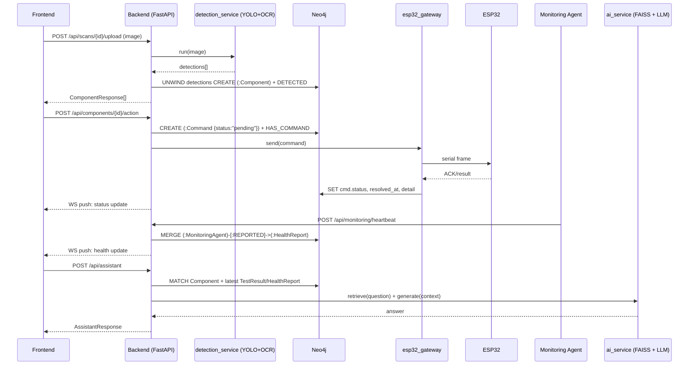
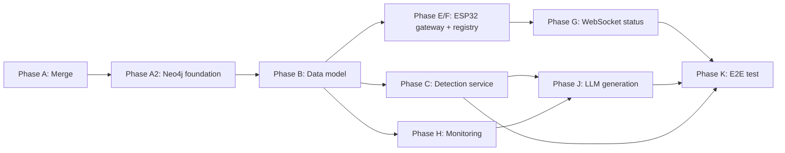

# Circuit Loop — Backend Implementation Plan

> **Source of truth this plan builds on:** [`CIRCUIT_LOOP_PLAN.md`](./CIRCUIT_LOOP_PLAN.md) (repo root). Read that first for overall project scope, architecture, data model, and phase numbering (Phases A–K) — this document expands **only the backend slice** of that plan into an implementation-ready spec. Do not duplicate decisions made there; where this plan references "Phase C", "Phase E", etc., it means the same phase defined in `CIRCUIT_LOOP_PLAN.md` §5.
>
> This document does not modify `CIRCUIT_LOOP_PLAN.md` in place, but `CIRCUIT_LOOP_PLAN.md` has been updated to point here for database specifics — see its note under §5/§8.

## 0a. Language decision update (supersedes Python throughout this document)

**All new backend code is TypeScript (Node.js), not Python.** This is a further, explicit project-owner decision, distinct from and layered on top of §0's database decision. It changes *implementation language and file layout* only — every design decision elsewhere in this document (the Neo4j graph schema in §5, the API contract in §3, the phase breakdown in §16, the ESP32/monitoring/LLM architecture in §7–§9) is unaffected, because Cypher, HTTP contracts, and architecture are language-agnostic. Where this document still shows Python code samples (`backend/services/*.py`, `db.py`, pytest patterns), read them as the *design* those modules must implement — the actual implementation is TypeScript, under `backend/src/...`, as built below.

**What's implemented now (this phase — Neo4j foundation only, TypeScript):**

```text
backend/
  package.json, tsconfig.json, tsconfig.build.json   # Node ESM, strict TS, tsx (dev) / tsc (build)
  .env, .env.example                                  # unchanged from §0/§13 — still the source of Neo4j credentials
  src/
    config/env.ts       # typed Settings/Neo4jSettings, loadSettings() with fail-fast validation — TS port of the old config.py
    types/entities.ts    # Scan/Component/TestResult/Command/HealthReport/MonitoringAgent interfaces + NodeLabel/RelationshipType constants — TS expression of §5.2/§5.3
    db/neo4jDriver.ts     # initDriver/getDriver/closeDriver — TS port of §17.1's driver-lifecycle design, using the neo4j-driver npm package
    db/schema.ts            # ensureConstraintsAndIndexes() — runs the exact constraint/index Cypher from §5.4, unchanged
    index.ts                  # Express entry point: startup sequence, GET /api/health, SIGINT/SIGTERM → graceful shutdown
  tests/
    env.test.ts                # Vitest unit tests for loadSettings() validation (covers what pytest would have covered)
    schema.test.ts               # Vitest integration test against a real Neo4j instance — connects, bootstraps schema idempotently, verifies via SHOW CONSTRAINTS/SHOW INDEXES; skips with a clear message if Neo4j is unreachable
```

**Tooling choices for this phase:** Express (minimal, conventional — the one route in this phase doesn't need more), Vitest (matches the frontend's existing Vite-based tooling rather than introducing Jest), `neo4j-driver` (official, typed npm package), Node ESM with `module`/`moduleResolution: NodeNext` (mirrors the one Node-context file the frontend already had, `frontend/tsconfig.node.json`). `strict: true` plus `noUncheckedIndexedAccess`, `noImplicitOverride` are on; no `any`, no `@ts-ignore`/`@ts-nocheck` were needed anywhere in this phase.

**Verified, not just written:** `tsc --noEmit` clean, `tsc -p tsconfig.build.json` produces `dist/`, all 8 Vitest tests pass **against the real local Neo4j instance** (connectivity, idempotent constraint/index creation, presence of every constraint/index verified via `SHOW CONSTRAINTS`/`SHOW INDEXES`), and the server was started and its `GET /api/health` confirmed to return `200` live. One caveat: graceful shutdown via `SIGINT`/`SIGTERM` could not be verified through this Windows automation sandbox — Windows has no true POSIX signal delivery to a detached console process (`taskkill` without `/F` refused with "can only be terminated forcefully"), so the handler path was reviewed but not exercised end-to-end here; it follows the standard Node.js pattern and `closeDriver()` itself was proven correct (it ran successfully in the Vitest `afterAll` hook). Verify this specific path with a real Ctrl+C in an interactive terminal, or once deployed to Linux where `SIGTERM` delivery works.

**Still Python, unchanged, and intentionally out of scope for the TypeScript migration:** the detection model (YOLO+OCR, `rag/scripts/yolo_ocr.py`) and the RAG retrieval pipeline (`sentence-transformers`+FAISS, `rag/scripts/*`, `services/ai_service.py`). These remain Python-ecosystem code with no low-risk TypeScript equivalent already in the repo. **Open decision, to be confirmed before Phase C/Phase J:** keep them as a small internal Python service the TypeScript backend calls over HTTP (recommended — reuses this document's already-designed `detection_service`/`ai_service` logic almost unchanged), rather than porting them to Node or discarding them for a JS-native rewrite.

**Not yet implemented (next phase, per Phase A2 below, now split into TS-specific steps):** repositories (`src/repositories/*.ts`) for Scan/Component/TestResult, the routers that use them, and rewiring the API contract in §3 on top of this foundation.

---

## 0b. Milestone update — Scan/Component/TestResult/Dashboard API (Phase A2 + Phase B, done)

Built directly on §0a's foundation, in TypeScript:

```text
backend/src/
  db/session.ts, db/mappers.ts               # QueryRunner (session/tx-agnostic), Neo4j Integer/DateTime → number/ISO conversion
  types/dto.ts                                 # wire-format request/response DTOs (snake_case) + mapping to/from domain entities
  validation/*.ts                               # zod schemas — the TS analog of the old Pydantic schemas.py, incl. the
                                                  # pass/fail-requires-measured_value rule ported verbatim
  repositories/{scan,component,testResult,dashboard}Repository.ts   # all Cypher from §5.7, parameterized, never string-built from input
  services/{scan,component,testResult,dashboard}Service.ts           # repo "not found" (null) → NotFoundError; scan_id existence
                                                                       # validated before create/update, matching the original contract
  controllers/, routes/                                                # thin Express layer, typed Request<Params,ResBody,ReqBody,Query>
  middleware/{validate,errorHandler}.ts                                  # 400/404/500 → {"detail": ...}, matching §11's convention
  utils/{errors,asyncHandler,ids}.ts
```

**Contract changes recorded here, as required by the working rules before deviating from a documented contract:**
- Every id (`id`, `scan_id`, `component_id`) is now `string` (Neo4j UUID), not `number` — a necessary consequence of §5.1's already-made decision, not a new one. Nothing on `main` depended on the old shape yet.
- **New, additive endpoint:** `GET /api/components/:id/tests` — full test history, ordered oldest-first, 404 only if the component itself doesn't exist (an empty array is a valid answer, not an error). Requested explicitly for this phase; doesn't replace `.../test-result` (latest only), which is unchanged.
- List endpoints (`GET /api/scans`, `GET /api/components`) return the *summary* shape (`components: []` on scans; no nested `test_results` is skipped — components list still nests `test_results`, only *scans* list omits nested components) — this follows the already-specified §5.7 Cypher rather than the original SQL version's eager-load-everywhere behavior. Get-by-id endpoints return full nesting.

**Test-isolation pattern implemented as designed in §18:** every repository function takes an optional trailing `QueryRunner` (a session or a transaction — both satisfy the same structural `.run()` interface). Repository-level tests (`tests/{scan,component,testResult}Repository.test.ts`) inject one transaction per test via `session.beginTransaction()` and roll it back in `afterEach` — real Neo4j, zero risk of leftover data. API-level tests (`tests/api.test.ts`, via `supertest` against `createApp()`) go through the real committed write path (HTTP has no way to carry a test transaction through), so they instead track every created id and delete it in `afterEach` — the "identifiable records + cleanup" fallback this document's testing section allows. **Verified, not assumed:** ran the full suite twice against the real local Neo4j with a node-count check before/after both runs — empty → 55/55 tests pass → empty, both times.

**One bug found and fixed during manual verification (not caught by the test suite, since it never applies under Vitest):** the "only run the server when this file is executed directly" guard in `src/index.ts` used `new URL(process.argv[1], "file:")`, which doesn't correctly resolve a Windows path (backslashes, unencoded spaces) against `import.meta.url`. Fixed with Node's `pathToFileURL(process.argv[1])`. Caught by actually starting the server and observing it exit immediately with no output — a reminder that "tests pass" and "the process actually runs" are different claims.

**Manually verified end-to-end** (not just unit-tested): started the real server, ran create-scan → post-detections → get-component → post-test-result → get-scan (nested detail) → dashboard-stats through real `curl` requests against the real Neo4j instance, then cleaned up the created data — full response bodies inspected, matched the documented contract exactly.

**Still not built:** ESP32 gateway/commands (Phase E/F, blocked on protocol source), monitoring (Phase H), assistant/RAG generation (Phase J, blocked on Python-ML-interop decision — still unresolved, not touched this phase per explicit instruction).

---

## 0. Database decision update (supersedes earlier SQLite assumption)

The backend code that exists today on `origin/Backend` / `origin/rag-integration:backend/` uses **SQLAlchemy + SQLite**. That was accurate when the previous version of this plan was written, based on what was actually in the repo. **The project owner has since decided Neo4j is the primary database**, regardless of what the unmerged branches currently contain. This plan is updated accordingly:

- **Neo4j is the database going forward.** `database.py` (SQLAlchemy engine/session) and `models.py` (SQLAlchemy ORM classes) from the existing branches are **replaced**, not extended — this is the one deliberate exception to the master plan's general "reuse existing code, don't rewrite" rule, because the persistence technology itself changed by explicit requirement.
- **Everything else from the existing branches is still reused as planned:** FastAPI app structure, routers-as-controllers pattern, Pydantic schemas (validation rules like "pass/fail requires a measured_value" are business rules, not SQL-specific — they carry over unchanged), the `services/` layer convention, the existing test file's pattern of setting env vars before importing the app, and the RAG/detection pipelines (untouched by this change — they don't currently persist to the relational DB and won't be forced into Neo4j either; see §5.6).
- Credentials (`NEO4J_URI`, `NEO4J_USER`, `NEO4J_PASSWORD`) are supplied by the project owner directly into a local `.env` file — **never** written into this plan, into code, or committed to version control. See §13 and §22.

---

## 1. Current Backend Analysis

**The backend does not exist on `main`.** It exists, unmerged, on `origin/Backend` and — in its most complete, integrated form — on `origin/rag-integration:backend/`. The analysis below is of that code, since per `CIRCUIT_LOOP_PLAN.md` Phase A it's what the team should merge forward and build on — with its persistence layer replaced per §0.

### 1.1 Stack

| Layer | Existing (branches) | Target (this plan) |
|---|---|---|
| Framework | FastAPI (`fastapi>=0.141.1`) | ✅ unchanged |
| Database | SQLAlchemy 2.x + SQLite | **Neo4j** (official `neo4j` Python driver) |
| Validation | Pydantic v2 | ✅ unchanged |
| Server | Uvicorn | ✅ unchanged |
| Package manager | `uv` (`pyproject.toml` + `uv.lock`) | ✅ unchanged |
| Testing | `pytest` + `TestClient` | ✅ unchanged, + Neo4j test-transaction pattern (§18) |
| RAG deps | `sentence-transformers`, `faiss-cpu`, `numpy` | ✅ unchanged, stays file/FAISS-based (§5.6) |
| Detection deps | `ultralytics`, `opencv-python`, `pytesseract`, `Pillow` | ✅ unchanged |

### 1.2 Existing folder structure (`origin/rag-integration`, for reference)

```text
backend/
  main.py / database.py / models.py / schemas.py
  routers/{scans,components,detections,testing,dashboard,assistant}.py
  services/{ai_service.py}
  src/circuitloop/__init__.py     # dead uv scaffold, remove
  tests/test_api.py
rag/{data,scripts,vector_db}      # untouched by the DB change
models/pcb_yolo11s_best.pt
```

`database.py` and `models.py` are the two files this plan replaces; everything else in this tree is a starting point to build on.

### 1.3 What already works and carries over (✅, verified by reading the code + existing tests)

- Full CRUD contract for scans/components (shapes, not SQL implementation).
- `POST /api/detections` batch-insert contract — keep the request/response shape; reimplement the insert against Neo4j (§5.4).
- `TestResultCreate`'s validation that `pass`/`fail` requires `measured_value` — a Pydantic-level rule, entirely independent of the database, keep verbatim.
- `GET /api/dashboard/stats` aggregate shape — same response model, recomputed via Cypher instead of SQL `func.count`/`func.avg` (§5.4).
- `POST /api/assistant` contract and its existing FAISS-based retrieval in `ai_service.py` — **unaffected by the DB change**; it doesn't touch SQLAlchemy today and won't be forced to touch Neo4j either, though it will *read* component/test/health context from Neo4j once Phase J context-assembly is built (§7.2, §5.6).
- The **idempotent startup-schema-setup convention** in `database.py::initialize_database()` (checks what exists, adds only what's missing) — this exact spirit carries over directly as the Neo4j constraint/index bootstrap (§5.3).
- The existing test pattern of setting configuration via environment variables **before** importing the app module — carries over for `NEO4J_URI`/`NEO4J_USER`/`NEO4J_PASSWORD` the same way it did for `CIRCUITLOOP_DATABASE_URL`.
- `src/circuitloop/__init__.py` — still dead scaffold, still flagged for removal.

### 1.4 What's stubbed or missing (unchanged from before, restated for completeness)

No image upload endpoint · no generative LLM call · no ESP32 gateway/serial code · no monitoring/heartbeat router · no authentication · no structured logging · `condition`/`salvage_priority` exist on the frontend type but not the backend model.

---

## 2. Required Backend Features and Responsibilities

Unchanged from the master plan's framing (`CIRCUIT_LOOP_PLAN.md` §5/§13): own the canonical data model; accept an image and persist detections; serve component data (incl. `condition`/`salvage_priority`); map components to ESP32 actions and relay ACK/failure/timeout; ingest monitoring heartbeats and evaluate health; answer assistant questions with retrieval + generation + live context. The only change from before is **how** "own the canonical data model" is implemented — as a graph, not relational tables.

---

## 3. API Endpoints and Request/Response Flow

**Unchanged from the previous version of this plan** — the HTTP contract (paths, methods, request/response JSON shapes, status codes) is independent of the database technology. Restated for completeness:

**Existing, keep as-is:** `GET /api/health` · `POST/GET /api/scans[/{id}]` · `POST/GET/PUT/DELETE /api/components[/{id}]` · `POST /api/detections` · `POST /api/components/{id}/test` · `GET /api/components/{id}/test-result` · `GET /api/dashboard/stats` · `POST /api/assistant`.

**New, per master plan phases:**
```text
POST /api/scans/{scan_id}/upload          # Phase C — image → detection
POST /api/components/{id}/action          # Phase E/F — trigger ESP32 command
GET  /api/components/{id}/status          # Phase G — latest command status
WS   /api/components/{id}/status/stream   # Phase G — live push
POST /api/monitoring/heartbeat            # Phase H — agent → backend
GET  /api/monitoring/components           # Phase H/I — health snapshot
WS   /api/monitoring/stream               # Phase I — live push
```

Every handler's *body* changes (Cypher via the Neo4j service layer instead of a SQLAlchemy `Session`), but no endpoint's URL, method, or JSON contract changes because of the database swap — this keeps the frontend integration plan (`CIRCUIT_LOOP_PLAN.md` §7) valid without modification.

---

## 4. Authentication and Authorization

Unchanged from the previous version of this plan: none today; don't build speculatively. If/when needed, a single shared `X-API-Key` header dependency on write endpoints is the minimal fit — see the earlier reasoning in `CIRCUIT_LOOP_PLAN.md` §12. This is orthogonal to the database choice. Note for later: Neo4j Community Edition (the assumed edition here — no license mentioned anywhere in the repo) has no built-in per-application-user role system beyond the single configured database user, so any app-level authorization must live in the FastAPI layer, not be delegated to Neo4j's own auth.

---

## 5. Database Design — Neo4j Graph Model

This is the core of this update. The graph is designed directly from the entities and relationships already defined in `CIRCUIT_LOOP_PLAN.md` §8 (Component Data Model) — no new entities are introduced beyond what that document already specifies as needed, plus one (`MonitoringAgent`) justified in §5.2 below.

### 5.1 Design principles

- **Node `id` is an application-generated UUID string property**, not Neo4j's internal id. Neo4j's internal ids are not stable business identifiers (they can be reused after deletion in some configurations) — every node gets an explicit `id: str` property, generated with `uuid4()` at creation time in the service layer, and every uniqueness constraint is on that property.
- **Relationships carry direction and meaning, not just structure** — e.g. `(:Scan)-[:DETECTED]->(:Component)` reads naturally and matches the domain ("this scan detected this component").
- **Denormalized counters are avoided where a graph makes them unnecessary.** The old SQL model kept `Scan.total_components` in sync manually on every insert/delete. In Neo4j, `count()` over the `DETECTED` relationship is a cheap, always-correct alternative — computed on read instead of maintained on write. This removes a whole class of "counter drifted from reality" bugs the SQL version was exposed to.
- **Neo4j properties must be primitive types or arrays of primitives** — they cannot hold nested maps/objects directly. Where the domain has a genuinely free-form blob (heartbeat `metrics`), it's stored as a JSON-encoded string property (`metrics_json`) rather than forcing an artificial fixed schema on data that's inherently open-ended (§5.2 explains the trade-off and why known/common metrics still get their own typed properties).

### 5.2 Nodes (labels + properties)

```text
(:Scan)
  id: string (uuid, unique)
  image_path: string | null
  timestamp: datetime

(:Component)
  id: string (uuid, unique)
  type: string            # resistor | capacitor | led | diode | transistor | ic | microcontroller | unknown
  name: string | null      # OCR'd/marked value, e.g. "10kΩ", "U5"
  confidence: float        # 0..1, from YOLO
  condition: string        # good | damaged | uncertain | unknown  (default "unknown")
  salvage_priority: string | null   # high | medium | low
  x1, y1, x2, y2: float | null      # bounding box
  status: string            # not_tested | pass | fail
  created_at: datetime

(:TestResult)
  id: string (uuid, unique)
  expected_value: float | null
  measured_value: float | null
  unit: string | null
  status: string      # pass | fail | not_tested
  timestamp: datetime

(:Command)
  id: string (uuid, unique)
  action: string             # from command_registry, e.g. "power_test"
  status: string               # pending | success | failure | timeout
  sent_at: datetime
  resolved_at: datetime | null
  ack_received: boolean
  detail: string | null

(:MonitoringAgent)
  agent_id: string (unique)
  first_seen_at: datetime
  last_seen_at: datetime

(:HealthReport)
  id: string ("<agent_id>:<component_key>", unique — see §5.5 on why composite keys are avoided)
  agent_id: string
  component_key: string     # cpu | ram | disk | gpu | nic | ...
  status: string              # healthy | degraded | unresponsive | unknown
  metrics_json: string          # JSON-encoded metric blob (see §5.1)
  cpu_percent, ram_percent, disk_percent: float | null   # common metrics promoted to real properties for indexable/queryable access
  last_heartbeat_at: datetime
```

**Why `MonitoringAgent` is included (not an invented extra entity):** the master plan (`CIRCUIT_LOOP_PLAN.md` §9) already specifies heartbeats are pushed by "a local Monitoring Agent" with its own identity (`agent_id` appears in the `POST /api/monitoring/heartbeat` payload defined in the previous version of this plan, §3). Modeling the agent as a node — rather than only a string property on `HealthReport` — is what lets the graph answer real questions the feature needs anyway: "is this specific agent still checking in at all" (agent-level liveness, independent of any one component's heartbeat) and "which reports came from which agent" if multiple machines/agents are ever monitored. It is not a new concept, just the existing `agent_id` given a first-class node instead of a bare property.

**No node was added for datasheets/RAG chunks** — see §5.6.

### 5.3 Relationships

```text
(:Scan)-[:DETECTED]->(:Component)
(:Component)-[:HAS_TEST_RESULT]->(:TestResult)
(:Component)-[:HAS_COMMAND]->(:Command)
(:MonitoringAgent)-[:REPORTED]->(:HealthReport)
```

No relationship properties are needed for any of these — the timestamp of interest already lives on the target node (`TestResult.timestamp`, `Command.sent_at`, `HealthReport.last_heartbeat_at`), so a relationship property would be redundant.

### 5.4 Constraints and indexes

Neo4j Community Edition (assumed — no Enterprise license is referenced anywhere in the repo) supports **single-property** uniqueness constraints and range indexes, but not composite/`NODE KEY` constraints or property existence constraints. Every constraint below is written to work on Community Edition; `HealthReport`'s composite identity (`agent_id` + `component_key`) is therefore collapsed into the single `id` string property described in §5.2 specifically so a plain uniqueness constraint can enforce it without needing Enterprise features.

```cypher
// Constraints — one per node label's business identifier
CREATE CONSTRAINT scan_id_unique         IF NOT EXISTS FOR (s:Scan)            REQUIRE s.id IS UNIQUE;
CREATE CONSTRAINT component_id_unique    IF NOT EXISTS FOR (c:Component)       REQUIRE c.id IS UNIQUE;
CREATE CONSTRAINT testresult_id_unique   IF NOT EXISTS FOR (t:TestResult)      REQUIRE t.id IS UNIQUE;
CREATE CONSTRAINT command_id_unique      IF NOT EXISTS FOR (cmd:Command)       REQUIRE cmd.id IS UNIQUE;
CREATE CONSTRAINT healthreport_id_unique IF NOT EXISTS FOR (h:HealthReport)    REQUIRE h.id IS UNIQUE;
CREATE CONSTRAINT agent_id_unique        IF NOT EXISTS FOR (a:MonitoringAgent) REQUIRE a.agent_id IS UNIQUE;

// Indexes — on properties the API actually filters/sorts by
CREATE INDEX component_type_index             IF NOT EXISTS FOR (c:Component)   ON (c.type);
CREATE INDEX component_status_index           IF NOT EXISTS FOR (c:Component)   ON (c.status);
CREATE INDEX component_salvage_priority_index IF NOT EXISTS FOR (c:Component)   ON (c.salvage_priority);
CREATE INDEX scan_timestamp_index             IF NOT EXISTS FOR (s:Scan)        ON (s.timestamp);
CREATE INDEX command_status_index             IF NOT EXISTS FOR (cmd:Command)   ON (cmd.status);
CREATE INDEX healthreport_status_index        IF NOT EXISTS FOR (h:HealthReport) ON (h.status);
```

Every constraint doubles as an index on that property (Neo4j creates one automatically), so no separate index is declared for `id` lookups. All statements use `IF NOT EXISTS`, making them safe to run on every startup — the same idempotent-bootstrap spirit as the existing `initialize_database()`.

**New file:** `backend/db/schema.py` — a Python function `ensure_constraints_and_indexes(driver)` that runs the block above (as a list of statements, executed in an auto-commit session since `CREATE CONSTRAINT`/`CREATE INDEX` cannot run inside an explicit transaction in Neo4j), called once at application startup.

### 5.5 ID strategy detail

Every repository "create" function generates its own `id = str(uuid4())` in Python **before** the Cypher `CREATE`, and passes it as a parameter — this keeps ID generation testable and provider-agnostic (no dependency on Neo4j-specific ID functions), and matches how the existing Pydantic response schemas already expect a settled `id` value to serialize back to the client.

### 5.6 What deliberately stays outside Neo4j

- **RAG chunks/embeddings/FAISS index** (`rag/data/*.json`, `rag/vector_db/*`) — these remain exactly where they are today (flat files + FAISS), per `CIRCUIT_LOOP_PLAN.md` §10's explicit instruction not to rebuild the working retrieval pipeline. There is no product requirement yet to make datasheet knowledge graph-queryable (e.g., "which chunks mention which component types" as traversable relationships) — introducing that now would be exactly the kind of unnecessary entity the task asked not to invent. If a future requirement needs chunk-to-component graph relationships, that's a deliberate, separate design decision, not a side effect of "we're using Neo4j now."
- **Uploaded image files** — stored on disk (path referenced by `Scan.image_path`), not as Neo4j properties (binary/large data doesn't belong in property values).

### 5.7 Cypher reference — the operations the API layer needs

```cypher
// -- Scans --------------------------------------------------------------
// Create
CREATE (s:Scan {id: $id, image_path: $image_path, timestamp: datetime()})
RETURN s;

// List (with computed component count, replaces the old denormalized counter)
MATCH (s:Scan)
OPTIONAL MATCH (s)-[:DETECTED]->(c:Component)
RETURN s, count(c) AS total_components
ORDER BY s.timestamp DESC;

// Get one, with components and their test results
MATCH (s:Scan {id: $id})
OPTIONAL MATCH (s)-[:DETECTED]->(c:Component)
OPTIONAL MATCH (c)-[:HAS_TEST_RESULT]->(t:TestResult)
RETURN s, collect(DISTINCT c) AS components, collect(DISTINCT t) AS test_results;

// -- Components -----------------------------------------------------------
// Create, optionally attached to a scan
MATCH (s:Scan {id: $scan_id})                      // omit this MATCH + the CREATE below when scan_id is null
CREATE (c:Component {
  id: $id, type: $type, name: $name, confidence: $confidence,
  condition: coalesce($condition, "unknown"), salvage_priority: $salvage_priority,
  x1: $x1, y1: $y1, x2: $x2, y2: $y2, status: "not_tested", created_at: datetime()
})
CREATE (s)-[:DETECTED]->(c)
RETURN c;

// Batch create (POST /api/detections and POST /api/scans/{id}/upload share this)
MATCH (s:Scan {id: $scan_id})
UNWIND $detections AS d
CREATE (c:Component {
  id: d.id, type: d.type, name: d.name, confidence: d.confidence,
  x1: d.bbox.x1, y1: d.bbox.y1, x2: d.bbox.x2, y2: d.bbox.y2,
  status: "not_tested", condition: "unknown", created_at: datetime()
})
CREATE (s)-[:DETECTED]->(c)
RETURN c;

// Get one, with test results
MATCH (c:Component {id: $id})
OPTIONAL MATCH (c)-[:HAS_TEST_RESULT]->(t:TestResult)
RETURN c, collect(t) AS test_results;

// List (optionally filtered — parameters may be null, meaning "no filter")
MATCH (c:Component)
WHERE ($type IS NULL OR c.type = $type)
  AND ($status IS NULL OR c.status = $status)
RETURN c
ORDER BY c.id;

// Update
MATCH (c:Component {id: $id})
SET c += $updates
RETURN c;

// Delete (DETACH DELETE removes its relationships too — TestResult/Command nodes
// attached only to this component become orphaned and should be deleted explicitly
// first if full cleanup is desired; see note below)
MATCH (c:Component {id: $id})
OPTIONAL MATCH (c)-[:HAS_TEST_RESULT]->(t:TestResult)
OPTIONAL MATCH (c)-[:HAS_COMMAND]->(cmd:Command)
DETACH DELETE c, t, cmd;

// -- Test results -----------------------------------------------------------
// Create + update parent component's status in one write
MATCH (c:Component {id: $component_id})
CREATE (t:TestResult {
  id: $id, expected_value: $expected_value, measured_value: $measured_value,
  unit: $unit, status: $status, timestamp: datetime()
})
CREATE (c)-[:HAS_TEST_RESULT]->(t)
SET c.status = $status
RETURN t;

// Latest for a component
MATCH (:Component {id: $component_id})-[:HAS_TEST_RESULT]->(t:TestResult)
RETURN t
ORDER BY t.timestamp DESC
LIMIT 1;

// -- Dashboard stats --------------------------------------------------------
CALL { MATCH (s:Scan) RETURN count(s) AS total_scans }
CALL {
  MATCH (c:Component)
  RETURN count(c) AS total_components,
         avg(c.confidence) AS average_ai_confidence,
         sum(CASE WHEN c.status = 'pass' THEN 1 ELSE 0 END) AS passed_components,
         sum(CASE WHEN c.status = 'fail' THEN 1 ELSE 0 END) AS failed_components,
         sum(CASE WHEN c.status = 'not_tested' THEN 1 ELSE 0 END) AS not_tested_components
}
RETURN total_scans, total_components, average_ai_confidence,
       passed_components, failed_components, not_tested_components,
       (passed_components + failed_components) AS tested_components;

// -- Commands (ESP32) ---------------------------------------------------------
// Reject if a pending command already exists for this component (§8 conflict handling)
MATCH (:Component {id: $component_id})-[:HAS_COMMAND]->(cmd:Command {status: "pending"})
RETURN cmd
LIMIT 1;

// Create
MATCH (c:Component {id: $component_id})
CREATE (cmd:Command {
  id: $id, action: $action, status: "pending",
  sent_at: datetime(), resolved_at: null, ack_received: false, detail: null
})
CREATE (c)-[:HAS_COMMAND]->(cmd)
RETURN cmd;

// Resolve (called by esp32_gateway on ACK/failure/timeout)
MATCH (cmd:Command {id: $id})
SET cmd.status = $status, cmd.resolved_at = datetime(),
    cmd.ack_received = $ack_received, cmd.detail = $detail
RETURN cmd;

// Latest status for a component
MATCH (:Component {id: $component_id})-[:HAS_COMMAND]->(cmd:Command)
RETURN cmd
ORDER BY cmd.sent_at DESC
LIMIT 1;

// -- Monitoring / heartbeats ---------------------------------------------------
// Upsert agent + its reported components in one call
MERGE (a:MonitoringAgent {agent_id: $agent_id})
  ON CREATE SET a.first_seen_at = datetime()
  SET a.last_seen_at = datetime()
WITH a
UNWIND $components AS comp
MERGE (h:HealthReport {id: $agent_id + ':' + comp.key})
  ON CREATE SET h.agent_id = $agent_id, h.component_key = comp.key
  SET h.status = comp.status,
      h.metrics_json = comp.metrics_json,
      h.cpu_percent = comp.cpu_percent,
      h.ram_percent = comp.ram_percent,
      h.disk_percent = comp.disk_percent,
      h.last_heartbeat_at = datetime()
MERGE (a)-[:REPORTED]->(h)
RETURN h;

// Current snapshot, with staleness computed at read time (no background job needed for MVP)
MATCH (h:HealthReport)
RETURN h, duration.between(h.last_heartbeat_at, datetime()).seconds AS seconds_since_heartbeat;
```

---

## 6. Data Flow (Frontend ↔ Backend ↔ Neo4j ↔ External Services)



---

## 7. AI/Model Integration (Detection + LLM)

Unchanged in substance from the previous version of this plan; only the context-loading step now reads from Neo4j.

### 7.1 Detection model (YOLO+OCR) integration — Phase C
Unchanged: wrap `rag/scripts/yolo_ocr.py`'s `extract_detected_text()` as an importable function in a new `backend/services/detection_service.py`, called from a new `POST /api/scans/{id}/upload` endpoint. The only change from the prior version of this plan: the endpoint's persistence step now calls the Neo4j batch-create Cypher in §5.7 (via a shared `component_repository.create_batch(...)` function used by both this endpoint and the existing `POST /api/detections` router) instead of the old SQLAlchemy insert.

### 7.2 LLM generation integration — Phase J
Unchanged in approach: append a generation call to `services/ai_service.py` after its existing FAISS retrieval, without touching the retrieval code. What changes: `routers/assistant.py` now loads context via `component_repository.get_with_test_results(component_id)` and `health_repository.get_for_component(component_id)` (Cypher, §5.7) instead of a SQLAlchemy query, before passing that context into `ai_service.answer_question()`. Fallback behavior (return raw retrieved chunks if generation fails/unconfigured) is unchanged.

---

## 8. ESP32/Hardware Communication Backend Integration

Unchanged in design from the previous version of this plan (still greenfield, still blocked on the protocol-source decision in `CIRCUIT_LOOP_PLAN.md` §12). The only change: `Command` is now a Neo4j node (§5.2) connected to its `Component` via `HAS_COMMAND` (§5.3) instead of a SQL foreign-key row, and the "reject if already pending" conflict check (§20 in the previous version) is the Cypher query in §5.7. `backend/services/esp32_gateway.py`, `backend/services/command_registry.py`, and `backend/routers/actions.py` are still the three new files; their internals now call a new `backend/repositories/command_repository.py` for persistence instead of a SQLAlchemy session.

---

## 9. Internal Monitoring Backend Integration

Unchanged in design (`CIRCUIT_LOOP_PLAN.md` §9 has the full rationale). `HealthReport`/`MonitoringAgent` are now Neo4j nodes (§5.2/§5.3) instead of a SQL table; `backend/routers/monitoring.py` and `backend/services/health_evaluator.py` are unchanged as concepts, backed by a new `backend/repositories/health_repository.py` implementing the upsert/read Cypher in §5.7. Staleness ("unresponsive") is still evaluated lazily on read (via the `duration.between(...)` computation in the read query), not by a background scheduler — same MVP reasoning as before.

---

## 10. File/Data Processing and Validation

Unchanged — this is a Pydantic-schema concern, independent of the database. See the previous version's reasoning for image content-type/size validation, detection batch validation (existing `DetectionCreate`/`DetectionBatchCreate` schemas, reused as-is), heartbeat payload validation, and command-action validation via `command_registry.py`.

---

## 11. Error Handling and Logging

Unchanged HTTP-error-shape convention (`HTTPException(status_code, detail=...)`, following `main.py`'s existing `400` vs `422` split). **New, Neo4j-specific:**

- Catch and translate `neo4j.exceptions.ServiceUnavailable` (DB unreachable) and `neo4j.exceptions.AuthError` (bad credentials) at the driver-initialization point (§17) into a clear startup failure — the app should refuse to start rather than come up in a broken state, matching how `config.py` already fails fast on missing env vars (§13).
- Catch `neo4j.exceptions.TransientError` (e.g., leader-switch in a clustered deployment, deadlock detection) inside repository write functions and retry once with a short backoff before surfacing a `503` — this is standard guidance from the Neo4j driver docs for any multi-writer scenario; for a single local Community-edition instance it will rarely trigger, but costs nothing to handle correctly now.
- Log every Cypher write at `DEBUG` (statement name, not full parameter dump — avoid logging component OCR text or question text at a level enabled in production) and every driver connection lifecycle event (`init`, `verify_connectivity` success/failure, `close`) at `INFO`.

---

## 12. Security Considerations

Unchanged general stance (no auth today, localhost-only CORS, don't build speculatively — §4). **Neo4j-specific additions:**

- **Credentials only via environment variables**, loaded from a local `.env` that is git-ignored (§13, §22) — never hardcoded in `config.py`, `neo4j_driver.py`, this plan, or any test file.
- **Connection encryption:** the local dev URI (`neo4j://...`) is unencrypted, which is fine for `127.0.0.1`. If Neo4j is ever hosted remotely, switch the scheme to `neo4j+s://` (encrypted) — this is a URI-only change, nothing else in the code needs to differ, so no design work is needed now, just a note for later.
- **Least privilege:** Neo4j Community Edition ties permissions to the single configured database user rather than offering fine-grained roles — there's no in-database way to restrict the backend to "read-only" or "this label only." If that granularity is ever needed, it requires Enterprise Edition; not a gap this plan can close within Community.
- **No credentials in logs** — reiterated from §11: the driver's own connection string is never logged with the password embedded (the `neo4j` driver's `auth=(user, password)` tuple form, used in §17, never appears as a single connection-string log line).

---

## 13. Environment Variables and Configuration

| Variable | Status | Purpose |
|---|---|---|
| `NEO4J_URI` | 🔵 new, **required** | Bolt connection URI, e.g. `neo4j://127.0.0.1:7687` |
| `NEO4J_USER` | 🔵 new, **required** | Neo4j database user |
| `NEO4J_PASSWORD` | 🔵 new, **required** | Neo4j database password |
| `NEO4J_DATABASE` | 🔵 new, optional | Named database within the DBMS; omit to use the server default (`neo4j`) |
| `CIRCUITLOOP_AI_API_KEY` | 🟡 reserved, unused until Phase J | LLM provider key |
| `TESSERACT_CMD` | ✅ existing | Path to Tesseract binary if not on `PATH` |
| `CIRCUITLOOP_LOG_LEVEL` | 🔵 new | Logging verbosity |
| `CIRCUITLOOP_ESP32_PORT` / `_BAUD` / `_ACK_TIMEOUT_MS` | 🔵 new | ESP32 gateway config (Phase E/F) |
| `CIRCUITLOOP_HEARTBEAT_STALE_AFTER_S` | 🔵 new | Staleness window (Phase H) |
| `CIRCUITLOOP_API_KEY` | 🔵 new, conditional | Only if the auth gate (§4) is added |

`CIRCUITLOOP_DATABASE_URL` (the old SQLite variable) is **removed** — it has no meaning under Neo4j.

**Implemented now** (see §22): `backend/config.py` loads all of the above via `python-dotenv` + `os.getenv`, and **fails fast with a clear `RuntimeError`** listing exactly which required `NEO4J_*` variable(s) are missing if any are absent — this satisfies the explicit requirement that misconfiguration surfaces immediately at startup, not as a confusing connection error three layers deep.

---

## 14. Backend Folder/File Structure (target state)

```text
backend/
  .env                        # NEW — real local values, git-ignored (never committed)
  .env.example                 # NEW — same variable names, empty placeholders, committed
  config.py                     # NEW — env loading + validation (implemented now, §22)
  main.py                        # add: lifespan hooks (init/close Neo4j driver, run schema bootstrap), new routers
  schemas.py                      # add: ActionCreate, CommandResponse, HeartbeatCreate, HealthReportResponse
  db/
    neo4j_driver.py                 # NEW — driver init/reuse/close (§17)
    schema.py                        # NEW — ensure_constraints_and_indexes() (§5.4)
  repositories/                      # NEW — replaces models.py; one file per node type, holds that type's Cypher
    scan_repository.py
    component_repository.py
    test_result_repository.py
    command_repository.py
    health_repository.py
  routers/
    scans.py                          # add: POST /{id}/upload
    components.py                      # unchanged shape, backed by component_repository now
    detections.py                       # backed by component_repository.create_batch, shared with upload endpoint
    testing.py                           # backed by test_result_repository
    dashboard.py                          # backed by aggregate Cypher (§5.7)
    assistant.py                           # loads context via component_repository + health_repository
    actions.py                              # NEW — Phase E/F/G
    monitoring.py                            # NEW — Phase H/I
  services/
    ai_service.py                             # add generation step after existing retrieval
    llm_client.py                              # NEW — provider SDK wrapper
    detection_service.py                        # NEW — wraps rag/scripts/yolo_ocr.py
    esp32_gateway.py                             # NEW
    command_registry.py                           # NEW
    health_evaluator.py                            # NEW
  tests/
    conftest.py                                     # NEW — Neo4j test-transaction fixture (§18)
    test_api.py                                      # existing, extend in place
    test_neo4j_schema.py                              # NEW — constraint/index bootstrap idempotency
    test_repositories.py                               # NEW
    test_uploads.py / test_actions.py / test_monitoring.py / test_assistant.py   # NEW
  # REMOVED: database.py, models.py (SQLAlchemy), src/circuitloop/ (dead scaffold)
```

---

## 15. Required Services, Controllers, Routes, Middleware, Utilities

Unchanged from the previous version, with one structural addition: a **repositories/** layer sits between routers and Neo4j (replacing the role `models.py` + SQLAlchemy sessions used to play) — each repository file owns the Cypher for one node type, keeping routers free of raw Cypher strings, the same separation of concerns the old code had between routers and SQLAlchemy models. Middleware (CORS) and the auth-dependency option (§4) are unaffected by the DB choice.

---

## 16. Step-by-Step Implementation Phases (Backend Slice)

### Phase A — Merge & Cleanup
Unchanged: merge `origin/rag-integration` → `main`, delete `backend/src/circuitloop/`.

### Phase A2 — Neo4j Foundation *(new phase, inserted here — everything from Phase B onward now depends on this instead of the old SQLite setup)*
1. **What:** Implement `backend/config.py` (done now, §22), `backend/db/neo4j_driver.py`, `backend/db/schema.py`, and the `repositories/` layer for `Scan`/`Component`/`TestResult` (the three entities the existing endpoints already need). Rewire `routers/scans.py`, `routers/components.py`, `routers/detections.py`, `routers/testing.py`, `routers/dashboard.py` to call repositories instead of SQLAlchemy. Delete `database.py`/`models.py`.
2. **Why:** every existing endpoint needs a working Neo4j-backed implementation before any new feature (upload, actions, monitoring) can be added on top.
3. **Files affected:** all routers listed above, `main.py` (lifespan wiring).
4. **New files:** `backend/config.py`, `backend/db/neo4j_driver.py`, `backend/db/schema.py`, `backend/repositories/{scan,component,test_result}_repository.py`.
5. **Connects to:** the credentials supplied by the project owner (§0) via `backend/.env`; the constraints/indexes in §5.4 must exist before any write happens, so `ensure_constraints_and_indexes()` runs in the app's `lifespan` startup block before the app is marked ready.
6. **Test:** `tests/conftest.py`'s Neo4j fixture (§18) connects successfully; `tests/test_api.py`'s existing scenarios (scan+detection flow, test+dashboard, validation) pass unmodified against the new repository-backed routers — this is the single strongest regression check that the Neo4j rewrite preserves the existing contract.

### Phase B — Data Model Standardization
1. **What:** Add `condition`, `salvage_priority` properties to `Component` nodes (no ALTER TABLE equivalent needed — Neo4j nodes don't have a fixed schema, so new properties simply start being set going forward; §5.4's index on `salvage_priority` should be created alongside).
2. **Why/Files/Test:** same reasoning as the previous version of this plan, adjusted for property-based-not-column-based storage.

### Phase C — Detection Service + Upload Endpoint
As §7.1. **Dependency:** Phase A2 (needs a working `component_repository.create_batch`), Phase B (new components should carry the full field set immediately).

### Phase D — (Frontend-only; no backend change beyond what Phase C already exposes)

### Phase E/F — ESP32 Gateway + Command Registry + Action Endpoints
As §8. **Dependency:** Phase A2 (for `command_repository`), blocked on protocol source decision per `CIRCUIT_LOOP_PLAN.md` §12.

### Phase G — Real-Time Status (WebSocket)
Unchanged from previous version.

### Phase H — Monitoring Backend
As §9. **Dependency:** Phase A2 (for `health_repository`).

### Phase I — (Frontend-only)

### Phase J — LLM Generation
As §7.2. **Dependency:** Phase A2 (context loading needs working repositories), provider decision (`CIRCUIT_LOOP_PLAN.md` §12).

### Phase K — End-to-End Integration Testing
Unchanged, now includes the Neo4j fixture in its setup.

---

## 17. Task Dependencies (summary graph)



Everything now funnels through **Phase A2** first — this is the one structural change to the dependency graph versus the previous version of this plan, since no endpoint can do anything without a working Neo4j-backed repository layer underneath it.

### 17.1 Driver lifecycle (Phase A2 detail)

```python
# backend/db/neo4j_driver.py — connection init, reuse, error handling, graceful shutdown
from neo4j import GraphDatabase, Driver
from neo4j.exceptions import AuthError, ServiceUnavailable

_driver: Driver | None = None

def init_driver(uri: str, username: str, password: str, database: str | None = None) -> Driver:
    """Create and verify a single, process-wide driver instance. Called once from
    the FastAPI lifespan startup handler — never per-request."""
    global _driver
    driver = GraphDatabase.driver(uri, auth=(username, password))
    try:
        driver.verify_connectivity()
    except AuthError as exc:
        raise RuntimeError(
            "Neo4j authentication failed — check NEO4J_USER/NEO4J_PASSWORD in backend/.env"
        ) from exc
    except ServiceUnavailable as exc:
        raise RuntimeError(
            f"Could not reach Neo4j at {uri} — is the database running and NEO4J_URI correct?"
        ) from exc
    _driver = driver
    return driver

def get_driver() -> Driver:
    """Used by repositories to obtain the shared driver — never constructs a new one."""
    if _driver is None:
        raise RuntimeError("Neo4j driver not initialized — init_driver() must run at app startup")
    return _driver

def close_driver() -> None:
    """Called from the FastAPI lifespan shutdown handler."""
    global _driver
    if _driver is not None:
        _driver.close()
        _driver = None
```

- **Reuse:** one `Driver` per process (the `neo4j` driver already pools connections internally — repositories call `get_driver().session(...)` per unit of work, they never create a new `Driver`).
- **Error handling:** distinguishes auth failure from unreachable-host failure at startup with actionable messages (per §11); write-time `TransientError` retry is handled in the repository layer, not here.
- **Graceful shutdown:** wired into `main.py`'s `lifespan` context manager (`init_driver()` before `yield`, `close_driver()` after) so the driver's connection pool is cleanly released on app shutdown rather than left open.

---

## 18. Testing Strategy (backend-specific, updated for Neo4j)

- **Unit level:** unchanged — `detection_service`, `esp32_gateway`, `command_registry`, `health_evaluator`, `llm_client` tested with all I/O mocked.
- **Repository/integration level — Neo4j test isolation pattern (new):** rather than standing up a separate test database (Community Edition doesn't support multiple databases per DBMS, so `CREATE DATABASE circuitloop_test` isn't available) or wiping data between tests, `tests/conftest.py` provides a fixture that opens an **explicit transaction** per test and rolls it back on teardown:

```python
# backend/tests/conftest.py
import pytest
from neo4j import GraphDatabase

from backend.config import settings

@pytest.fixture(scope="session")
def neo4j_driver():
    driver = GraphDatabase.driver(
        settings.neo4j.uri, auth=(settings.neo4j.username, settings.neo4j.password)
    )
    try:
        driver.verify_connectivity()
    except Exception as exc:
        pytest.skip(f"Neo4j not reachable at {settings.neo4j.uri} — skipping integration tests: {exc}")
    yield driver
    driver.close()

@pytest.fixture()
def neo4j_tx(neo4j_driver):
    """One rolled-back transaction per test — nothing written here is ever committed,
    so the graph is left exactly as it was regardless of test outcome."""
    with neo4j_driver.session(database=settings.neo4j.database) as session:
        tx = session.begin_transaction()
        yield tx
        tx.rollback()
```

  Repository functions accept a transaction/session object as a parameter (not a hidden global), so tests call them directly against `neo4j_tx` and assert on the returned records without any cleanup step.
- **API level:** `TestClient`-based tests per router, following the existing `tests/test_api.py` pattern, with the app's Neo4j session dependency overridden to yield `neo4j_tx` for the duration of each test (FastAPI's `app.dependency_overrides`).
- **Schema level:** `test_neo4j_schema.py` calls `ensure_constraints_and_indexes()` twice against the real driver and asserts no error — proves the `IF NOT EXISTS` bootstrap is safe to run on every app startup, not just the first.
- **What requires a real Neo4j instance to run at all:** every test above except pure unit tests. The `neo4j_driver` fixture's `pytest.skip(...)` on unreachable connection means the suite degrades gracefully (skipped, not failed) in an environment without Neo4j running — e.g., a CI job that hasn't been given credentials yet — while still running fully once `backend/.env` is filled in with real values.
- **What stays manual (not CI-automatable):** real ESP32 hardware-in-the-loop, real LLM provider smoke test, real monitoring agent on an actual machine — unchanged from the previous version of this plan.

---

## 19. Integration Strategy

Unchanged from the previous version — frontend integration via `frontend/src/api.ts`, detection model wrapped not rewritten, RAG pipeline untouched and additive-only, ESP32 contract defined now so firmware can proceed in parallel, monitoring agent kept as a separate process talking only over the heartbeat HTTP contract. None of this depended on the database technology, so none of it changes here.

---

## 20. Risks and Edge Cases (updated for Neo4j)

| Risk/Edge case | Handling |
|---|---|
| Neo4j not running / wrong credentials at startup | `init_driver()` fails fast with a distinct message for auth vs. unreachable-host (§17.1) — app refuses to start rather than serving requests against a broken DB layer. |
| Required `NEO4J_*` env var missing | `config.py` raises `RuntimeError` naming the exact missing variable(s) before the app object is even constructed (§22). |
| Community Edition's lack of composite/`NODE KEY` constraints | Worked around by collapsing `HealthReport`'s natural composite key into a single synthetic `id` string (§5.2/§5.4) — no Enterprise dependency introduced. |
| `DETACH DELETE` on a `Component` also removing its `TestResult`/`Command` history | Intentional — matches the existing SQL model's `cascade="all, delete-orphan"` behavior on `TestResult`; the delete query in §5.7 explicitly detaches and deletes both dependent node types together, not just the component. |
| Concurrent writes to the same `Component` (e.g., an action request and a test result landing near-simultaneously) | Each write is its own Cypher statement inside its own transaction (driver default); Neo4j's transaction isolation handles the ordering. The one *application-level* race that matters — two ESP32 actions on the same component — is explicitly guarded by the "reject if pending `Command` exists" check (§5.7, §8), not left to the database to arbitrate. |
| Transient cluster-style errors (`TransientError`) | Retried once with backoff in the repository write path (§11) — mostly theoretical for a single local instance, but free to handle correctly now rather than retrofit later. |
| Large heartbeat `metrics` payloads | Stored as `metrics_json` string (§5.1) rather than forcing every possible metric into its own indexed property — only the few common ones (`cpu_percent`, `ram_percent`, `disk_percent`) get real properties for query/index purposes. |
| Upload endpoint receives a very large/malicious image | Unchanged from the previous version — size cap + content-type check before decoding, independent of the database layer. |

---

## 21. Recommended Implementation Order (backend)

1. **Phase A** — merge `rag-integration` → `main`, remove dead scaffold.
2. **Phase A2** — Neo4j foundation: driver, schema bootstrap, repositories for the three existing entities, rewire the five existing routers onto them. *(New, mandatory first coding step — nothing else can be built or tested against a real database without this.)*
3. **Phase B** — extend `Component` with `condition`/`salvage_priority`.
4. **Phase C** — detection service + upload endpoint.
5. **Phase H** — monitoring backend (independent of ESP32, proceeds in parallel with step 6).
6. **Phase E/F** — ESP32 gateway skeleton + command registry (built/tested against a mocked serial device pending the protocol decision).
7. **Phase G** — WebSocket status push.
8. **Phase J** — LLM generation layer, once a provider is chosen.
9. **Phase K** — end-to-end backend integration test.

Same overall shape as the previous version of this plan, with Phase A2 inserted as the new mandatory second step — every later phase's "how to test" now assumes a real, reachable Neo4j instance via the fixture in §18, which only exists once Phase A2 is done.

---

## 22. What's been created now (implementation carve-out, per explicit request)

Per the project owner's explicit request, the following were created now, ahead of full backend implementation, so the configuration foundation exists as soon as real credentials are supplied:

- **`backend/.env`** — git-ignored, contains empty placeholders for `NEO4J_URI`, `NEO4J_USER`, `NEO4J_PASSWORD` (plus the other env vars from §13, also blank) for the project owner to fill in locally. **No credentials were written into this file or anywhere else** — they were provided in chat for context but were deliberately not persisted, per the explicit instruction to keep them out of every file until supplied directly into `.env`.
- **`backend/.env.example`** — same variable names, committed, empty values, safe to share.
- **`backend/config.py`** — loads `backend/.env` via `python-dotenv`, and validates at import time that `NEO4J_URI`, `NEO4J_USER`, `NEO4J_PASSWORD` are all present, raising a `RuntimeError` naming exactly which are missing if not. This module has no other dependency — it doesn't require the rest of `backend/` to exist, so it can be exercised standalone right now.

Everything else in this document (routers, repositories, driver module, services) remains **planned, not implemented** — consistent with "create the `.env` file and configuration structure now; implement the rest later."
