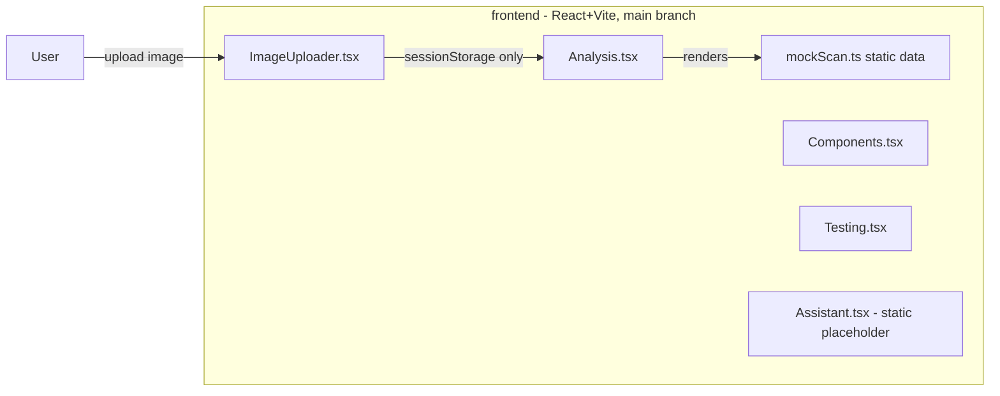
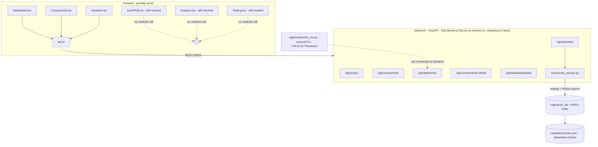
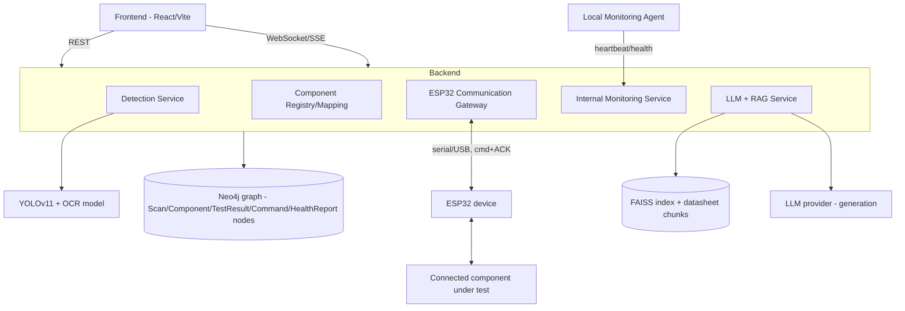

# Circuit Loop — Master Technical Plan

> ### ⚠️ Superseded in one area: RAG storage and retrieval
>
> Every reference below to **FAISS** as the RAG vector store (§"role of the
> LLM + RAG assistant", the RAG row in the status table, the architecture
> diagrams, §10) describes the pre-migration state and is retained as
> history.
>
> **As built:** Neo4j is the RAG store *and* the vector-search layer —
> `(:DatasheetChunk)` nodes carrying chunk text, metadata and a
> 384-dimension embedding, queried through the
> `datasheet_chunk_embedding_index` vector index. FAISS has been removed
> entirely. Two other statements below are also now out of date: retrieval is
> no longer "retrieval-only" (a real LLM generation step exists in the
> TypeScript backend), and §10's instruction not to rebuild the retrieval
> pipeline has been deliberately revisited.
>
> Current architecture:
> [`ml-service/README.md`](./ml-service/README.md#rag-corpus-neo4j).

> **Status of this document:** Living reference. Written from a full audit of the repository — including branches not checked out on `main` — as of 2026-08-27. Update it whenever architecture or implementation state changes; do not let it drift from the codebase.

---

## 0. How to read this document

Before any future feature work, re-read the relevant section(s) here first. Every claim below is tagged with one of:

- ✅ **Already implemented** — working code exists (branch noted).
- 🟡 **Partially implemented** — some code exists but is incomplete, unwired, or stubbed.
- 🔵 **Planned** — designed here, no code yet.
- ⚪ **Unknown / needs investigation** — cannot be determined from the repo; needs the user's input.

**Critical branch note:** `main` is **not** the most advanced branch. The repository has four branches with materially different content:

| Branch | What it is |
|---|---|
| `main` (checked out) | Frontend only, 100% mocked data, no network calls. |
| `origin/Backend` | Standalone FastAPI backend (CRUD, no frontend wiring). |
| `origin/RAG` | Standalone YOLO+OCR detection script and FAISS retrieval search app. |
| `origin/rag-integration` | **Merges Backend + RAG** into one project and wires part of the frontend to the real API. This is the most complete state of the project today, and is **not merged into `main`**. |

Every "already implemented" item below cites which branch it lives on. **Nothing described as implemented exists on `main` except the static frontend UI.**

**Database decision update:** the backend code that exists on `origin/Backend`/`origin/rag-integration` uses SQLAlchemy + SQLite — accurate to what's in those branches. The project owner has since decided **Neo4j is the primary database** for the project going forward, regardless of what those branches currently contain. Every mention of SQLite/SQLAlchemy below describes the *existing, unmerged* code as it is today; it does not describe the target. The full graph schema (nodes, relationships, constraints, indexes, Cypher) lives in [`BACKEND_IMPLEMENTATION_PLAN.md`](./BACKEND_IMPLEMENTATION_PLAN.md) §5 — treat that section as the authoritative database design, superseding the SQL-flavored data model sketched in §8 below.

---

## 1. Project Overview

**Circuit Loop** is a PCB salvage assistant: a user photographs a populated PCB, the system detects individual discrete/through-hole components on it (resistors, capacitors, LEDs, diodes, transistors, ICs, microcontrollers), reads any printed markings via OCR, and helps the user judge which components are worth desoldering and reusing. A chat assistant answers questions about detected components using retrieved datasheet text.

Two hardware-interaction visions are described for the project's future, **both currently unimplemented**:

- **External detection + ESP32 communication (🔵 Planned):** after a component is detected and selected, send a command to an ESP32 over serial/USB, which then talks to the physical component (e.g., power it, probe it) and returns an ACK/result. Verified once, in isolation, with an I2C LCD as a stand-in "device" — but **no code for that test exists anywhere in this git history**, on any branch. This piece must be treated as greenfield until the user supplies the actual sketch/protocol or confirms a from-scratch design.
- **Internal PC monitoring / heartbeat (🔵 Planned):** monitor the health of the PC's own internal hardware (CPU, RAM, disk, GPU, NIC) via a local agent. No code exists for this anywhere either.

The **role of the frontend** (React 19 + TypeScript + Vite, `frontend/`) is the single UI across all of this: upload/scan, view detections, view/trigger tests, view ESP32 status, view internal health, and chat with the assistant.

The **role of the backend** (FastAPI, exists today under `origin/rag-integration:backend/` using SQLAlchemy/SQLite — being migrated to **Neo4j** per the project owner's decision, see `BACKEND_IMPLEMENTATION_PLAN.md` §5) is to own the data model (scans, components, test results), receive detections, serve the frontend, and act as the integration point for everything else (ESP32 gateway, monitoring, RAG/LLM).

The **role of the LLM + RAG assistant** today is retrieval-only: it embeds a question, does a FAISS nearest-neighbor search over chunked datasheet PDFs, and returns the raw matching text. There is no generative LLM call anywhere in the repo yet.

---

## 2. Current System Inventory

| System | Status | Existing Implementation | Missing Work |
|---|---|---|---|
| PC Component Detection (YOLO+OCR) | 🟡 Partial | `origin/RAG:scripts/yolo_ocr.py` (also on `rag-integration`) — YOLOv11 model (`pcb_yolo11s_best.pt`) + Tesseract OCR on each crop, run as a CLI script, writes JSON to disk. | Not exposed as an API/service; nothing calls it from the backend; no image-upload endpoint. |
| ESP32 Protocol | ⚪ Missing / Unknown | Nothing in the repo. Task description says it was "tested with an I2C LCD," but no such code exists in any commit/branch. | Everything: Arduino sketch, message/ACK format, laptop-side serial client, retry/timeout logic. Needs the user's original code or a from-scratch design decision. |
| LCD I2C ACK Test | ⚪ Missing / Unknown | Same as above — not in the repo. | Same as above. |
| Frontend | 🟡 Partial | `main`: full 7-page UI shell (`frontend/src/pages/*`), all mocked. `rag-integration`: adds `frontend/src/api.ts` and wires `Dashboard.tsx`, `Components.tsx`, `Assistant.tsx` to the real backend. | `ScanPCB.tsx`, `Analysis.tsx`, `Testing.tsx`, `Reports.tsx` are unchanged/still mocked on every branch — no image is ever actually sent anywhere. |
| Backend | 🟡 Partial (unmerged) | `origin/Backend` / `origin/rag-integration:backend/` — FastAPI app, SQLAlchemy models (`Scan`, `Component`, `TestResult`), routers for scans/components/detections/testing/dashboard/assistant, pytest suite. | Not merged to `main`. Persistence layer (SQLAlchemy/SQLite) is being replaced with **Neo4j** — see `BACKEND_IMPLEMENTATION_PLAN.md` §5/§16 Phase A2. No image-upload endpoint. No auth. No ESP32/monitoring routers. Assistant stub only. |
| Detection ↔ Backend Integration | ⚪ Missing | `POST /api/detections` accepts a pre-computed JSON batch (contract exists and is tested). | Nothing actually calls `yolo_ocr.py` and posts its output there — the two pieces have never been connected. |
| Internal Monitoring | 🔵 Planned | Nothing. | Everything: agent, metrics collection, heartbeat protocol, backend endpoints, health model, frontend dashboard. |
| LLM | ⚪ Missing | `.env.example` on `origin/Backend` references an unused `CIRCUITLOOP_AI_API_KEY`. No SDK for any LLM provider is a dependency anywhere. | Choose a provider, wire a real generation call on top of existing retrieval. |
| RAG (retrieval) | ✅ Implemented (unmerged) | `origin/RAG` / `rag-integration:rag/` — `extract_and_chunk.py` (PDF→chunks via `pdfplumber`), `create_embeddings.py`, `build_faiss_index.py` (sentence-transformers `all-MiniLM-L6-v2` + FAISS), and `backend/services/ai_service.py` which loads the index and returns top-3 chunks for a question via `/api/assistant`. | Not merged to `main`. No generation step (returns raw chunk text, not a synthesized answer). Not fed component/health context. |

---

## 3. Current Architecture

### 3a. What actually runs today (`main`)



No network requests exist on `main`. Every page reads from `frontend/src/data/mockScan.ts`.

### 3b. What exists across the unmerged branches (`origin/rag-integration`)



The dotted lines mark connections that **do not exist yet** — they show where the pieces conceptually belong but aren't wired.

---

## 4. Target Architecture



### External Component Flow

```text
Image → POST /api/detections/analyze → yolo_ocr.py (YOLO+OCR) → Component rows created
      → Frontend displays detections → User selects component + action
      → POST /api/components/:id/action → Component→Command mapping
      → ESP32 Gateway sends command over serial → ESP32 → device
      → ESP32 returns ACK/result → Gateway relays via WebSocket
      → Frontend shows success/failure/timeout
```

### Internal Component Flow

```text
Local Monitoring Agent (background process on the PC)
   → collects CPU/RAM/disk/GPU/NIC signals on an interval
   → POST /api/monitoring/heartbeat (or push over WebSocket)
   → Backend evaluates health (missed-heartbeat window, threshold checks)
   → stored in DB → GET /api/monitoring/components / WebSocket push
   → Frontend health dashboard
```

### AI Assistant Flow

```text
User question + selected component_id
   → Backend loads component + latest test_result + latest health (if internal)
   → RAG retrieval (existing ai_service.py FAISS step, unchanged)
   → Compose context: component metadata + test/health results + retrieved chunks
   → LLM generation call (new)
   → Answer → Frontend
```

This target reuses the existing FastAPI backend, existing routers, existing FAISS/embedding pipeline, and the existing YOLO/OCR script as-is — it adds a detection-service wrapper, an ESP32 gateway, a monitoring service, and a generation step, rather than replacing anything.

---

## 5. Detailed Feature Plan

> Phases are ordered by dependency, not obligation — do them in this order.

### Phase A — Merge and Stabilize Existing Work
**Goal:** Make `main` match reality. **Why:** every other phase below assumes the backend/RAG code exists on the branch being worked on; right now it only exists on `rag-integration`. **Files:** merge `origin/rag-integration` → `main` (or rebase it forward and PR it). **Test:** `uv run pytest` in `backend/`, `npm run build` in `frontend/`, manually load the wired pages against a locally running backend.

### Phase A2 — Neo4j Foundation *(inserted — see `BACKEND_IMPLEMENTATION_PLAN.md` §16)*
**Goal:** Replace the merged-in SQLAlchemy/SQLite persistence layer with Neo4j (driver, schema bootstrap, repositories) before any new backend feature is built on top. **Why:** the project owner has decided Neo4j is the primary database; every phase from here on assumes a working Neo4j-backed repository layer, not SQLAlchemy sessions. Full detail: `BACKEND_IMPLEMENTATION_PLAN.md` §5, §16, §17.

### Phase B — Standardize Component Data Model
**Goal:** Reconcile `frontend/src/types/component.ts` (`PCBComponent`, camelCase, has `salvagePriority`/`condition`/`test`) with the backend `Component` SQLAlchemy model (snake_case, no salvage priority/condition fields) into one contract. **Why:** `Analysis.tsx`/`Testing.tsx` can't be wired until the shapes agree. **New:** a shared schema doc (Section 8 below) plus backend model/schema fields for `condition` and `salvage_priority`. **Test:** contract test asserting `GET /api/components/:id` response matches the frontend `ApiComponent`/`PCBComponent` shape.

### Phase C — Wrap Detection Model as a Backend Service
**Goal:** Turn `rag/scripts/yolo_ocr.py` into a callable service instead of a CLI script. **Files affected:** `backend/routers/detections.py`, new `backend/services/detection_service.py`. **New file:** `backend/routers/scans.py` gets (or a new router gets) `POST /api/scans/{id}/upload` accepting an image, running YOLO+OCR in-process, and calling the existing detection-creation logic. **Dependency:** Phase B (so results map onto the standardized model). **Test:** upload a sample PCB image via the endpoint, assert components are created with bounding boxes and OCR text.

### Phase D — Wire Remaining Frontend Pages to Real Data
**Goal:** `ScanPCB.tsx` posts to the new upload endpoint instead of `sessionStorage`; `Analysis.tsx`/`Testing.tsx` read live data via `api.ts` instead of `mockScan.ts`. **Files:** `frontend/src/pages/ScanPCB.tsx`, `Analysis.tsx`, `Testing.tsx`, extend `frontend/src/api.ts`. **Test:** manual E2E — upload real image, see real detections rendered.

### Phase E — ESP32 Communication Gateway (greenfield)
**Goal:** A backend-side service that owns a serial connection to the ESP32 and speaks a defined command/ACK protocol. **Why:** nothing exists yet; this needs a decision (Section 12) before implementation. **New files:** `backend/services/esp32_gateway.py`, `firmware/` (Arduino sketch), protocol doc. **Dependency:** blocked on the user confirming protocol design or supplying prior code. **Test:** loopback/mock serial device in CI; manual hardware test with a real ESP32.

### Phase F — Component-to-Command Mapping
**Goal:** Given a detected `Component`, determine which ESP32 command(s), if any, apply. **New file:** `backend/services/command_registry.py`, a static mapping table keyed by component `type`. **Test:** unit tests per component type (resistor → no action available, LED → "power test" command, etc. — final list needs user input).

### Phase G — Real-Time ACK/Status Updates
**Goal:** Push command progress/ACK/timeout to the frontend without polling. **New:** WebSocket endpoint `ws://.../api/components/{id}/status`. **Files:** `backend/main.py` (WebSocket route), `frontend/src/api.ts` (WS client), `Testing.tsx`. **Test:** simulate a command, assert the frontend receives `sent → ack → success/failure/timeout` transitions.

### Phase H — Internal PC Monitoring / Heartbeat System
See Section 9 for full design. **New:** `monitoring-agent/` (standalone local process), `backend/routers/monitoring.py`, `backend/models.py` additions (`HealthReport`). **Test:** run the agent locally, confirm heartbeats land in the DB and missed-heartbeat detection fires when the agent is killed.

### Phase I — Integrate Internal Health Into Frontend
**New:** a "System Health" section/page reading `GET /api/monitoring/components` (+ WebSocket for live updates). **Files:** new `frontend/src/pages/SystemHealth.tsx` or extend `Testing.tsx`. **Test:** manual — stop the agent, confirm the UI shows the component going stale/unhealthy after the timeout window.

### Phase J — LLM Generation Layer
**Goal:** Replace "return raw retrieved chunks" with an actual generated answer. **Files affected:** `backend/services/ai_service.py` (add a generation call after the existing FAISS retrieval — do not touch the retrieval code). **New:** provider client wrapper, `CIRCUITLOOP_AI_API_KEY`/model name via env var. **Test:** unit test with a mocked LLM client; manual test with a real key.

### Phase K — End-to-End Integration and Testing
Full scenario per Section 11. Runs after all of the above.

---

## 6. Detailed Data and Communication Flows

### Image Detection Flow
- **Input:** image file (PNG/JPEG) from `ScanPCB.tsx`.
- **Processing:** `POST /api/scans/{id}/upload` → `detection_service.py` runs YOLO inference → per-box Tesseract OCR → maps to `DetectionCreate` schema → reuses existing `create_detections` logic.
- **Output:** `list[ComponentResponse]` (existing schema, unchanged).
- **Errors:** unreadable image (415), no detections found (200 with empty list — not an error), model file missing (500, logged).
- **Timeout:** inference should run under a request timeout (e.g., 30s); if exceeded, return 504 and let the frontend retry.

### ESP32 Command Flow
- **Input:** `component_id`, `action` from frontend.
- **Processing:** validate component exists + action is valid for its type (`command_registry.py`) → gateway sends framed command over serial → wait for ACK with timeout.
- **Output:** `{status: "success"|"failure"|"timeout", detail}`.
- **Errors:** ESP32 not connected (503 immediately, no send attempt), malformed ACK (treated as failure, logged with raw bytes).
- **Timeout:** configurable (e.g., 3–5s default), surfaced distinctly from failure so the UI can say "no response" vs "device reported an error."

### Internal Heartbeat Flow
- **Input:** periodic POST from the local monitoring agent with per-component metric snapshot.
- **Processing:** backend upserts latest `HealthReport` per component, evaluates against thresholds, computes `healthy | degraded | unresponsive | unknown`.
- **Output:** stored report + evaluated status, available via `GET /api/monitoring/components`.
- **Errors:** malformed payload (400), unknown component key (still stored, flagged `unregistered`).
- **Timeout:** "missed heartbeat" is not a request timeout — it's the backend noticing no report arrived within `N × interval` and flipping status to `unresponsive`.

### AI/RAG Flow
- **Input:** `component_id`, `question`.
- **Processing:** existing FAISS retrieval (unchanged) + new context assembly (component row + latest test/health) + LLM generation call.
- **Output:** `AssistantResponse{message, configured}` (existing schema — `message` becomes generated text instead of raw chunks).
- **Errors:** component not found (404, existing), LLM call fails (fall back to returning raw retrieved chunks with `configured: false`-equivalent messaging, matching the existing "not configured" pattern already in the codebase).
- **Timeout:** generation call timeout (e.g., 15s) with the same fallback.

---

## 7. API and Event Design

**Reuse as-is (already implemented, `origin/rag-integration`):**
`GET /api/health`, `POST /api/scans`, `GET /api/scans`, `GET /api/scans/{id}`, `POST /api/components`, `GET /api/components`, `GET /api/components/{id}`, `PUT /api/components/{id}`, `DELETE /api/components/{id}`, `POST /api/detections`, `POST /api/components/{id}/test`, `GET /api/components/{id}/test-result`, `GET /api/dashboard/stats`, `POST /api/assistant`.

**New endpoints (🔵 Planned):**
```text
POST /api/scans/{id}/upload            # image → runs YOLO+OCR → creates detections (Phase C)
POST /api/components/{id}/action       # trigger an ESP32 command (Phase E/F)
GET  /api/components/{id}/status       # last known command/ACK status (Phase G)
POST /api/monitoring/heartbeat         # agent → backend (Phase H)
GET  /api/monitoring/components        # current health snapshot (Phase H/I)
```

**WebSocket/SSE — use only where polling would be awkward:**
- `ws://.../api/components/{id}/status` — ESP32 command progress + ACK (Phase G).
- `ws://.../api/monitoring/stream` — live health updates (Phase I).
Everything else stays plain REST — no benefit to adding real-time transport for CRUD-style reads.

---

## 8. Component Data Model

> The entities/fields below are the practical, storage-agnostic contract shared across frontend, backend, and AI context. For how they're actually persisted (Neo4j nodes, labels, relationships, constraints, indexes, and the Cypher to work with them), see `BACKEND_IMPLEMENTATION_PLAN.md` §5 — that section is authoritative on storage; this one is authoritative on shape.

```text
Component (reconciled: backend model + frontend type)
- id
- scan_id
- type            # resistor | capacitor | led | diode | transistor | ic | microcontroller | unknown
- name             # OCR'd/marked value, e.g. "10kΩ", "U5"
- confidence       # 0-1, from YOLO
- condition        # good | damaged | uncertain | unknown  (NEW field — currently only on frontend)
- salvage_priority # high | medium | low                    (NEW field — currently only on frontend)
- x1, y1, x2, y2   # bounding box
- status           # not_tested | pass | fail  (existing)
- created_at

Command
- id, component_id, action, sent_at, esp32_ack (bool), status (pending|success|failure|timeout), detail

TestResult (existing, unchanged)
- id, component_id, expected_value, measured_value, unit, status, timestamp

HealthReport (NEW)
- id, monitored_component (cpu|ram|disk|gpu|nic|...), status (healthy|degraded|unresponsive|unknown)
- metrics (json blob — component-specific), last_heartbeat_at

DetectionResult (wire format into POST /api/detections, existing schema)
- type, name, confidence, bbox{x1,y1,x2,y2}

ChatContext (assembled server-side per request, not persisted)
- component, latest_test_result, latest_health_report (if applicable), retrieved_chunks[]
```

---

## 9. Internal PC Monitoring Design

**Do not pretend every component sends a literal heartbeat.** Realistic signal sources per component:

| Component | Realistic signal | How |
|---|---|---|
| CPU | ✅ Load, temperature (if exposed), core count/frequency | OS metrics via `psutil`; temperature is best-effort (not always exposed, especially on Windows without vendor tools). |
| RAM | ✅ Usage, available, errors (if ECC + OS surfaces it) | `psutil.virtual_memory()`. |
| Storage | ✅ Usage, SMART health/status | `psutil` for usage; SMART needs a helper (e.g. `smartctl` via `pySMART`) — optional, degrade gracefully if unavailable. |
| GPU | 🟡 Vendor-dependent | NVIDIA: `nvidia-smi`/`pynvml`. AMD/Intel: much weaker/no reliable cross-platform API — treat as "unknown" rather than fake a number. |
| Motherboard/sensors | 🟡 Vendor-dependent, often Windows-admin/WMI-restricted | Best-effort only; explicitly mark "not monitorable" as an acceptable outcome, don't force a signal that doesn't exist. |
| Network adapter | ✅ Link state, throughput, error counters | `psutil.net_io_counters()`. |

**Architecture:** a small local **Monitoring Agent** (Python process, `monitoring-agent/agent.py`) runs on the PC, polls the above every `HEARTBEAT_INTERVAL` (default 10s), and POSTs a batch snapshot to `POST /api/monitoring/heartbeat`. The backend does **not** poll the PC directly — the agent pushes, matching the ESP32 side's asymmetry (backend can't reach into arbitrary hardware, so the agent must be the one with local access).

**Failure detection:** backend tracks `last_heartbeat_at` per monitored component; a background check (or lazily, on read) marks a component `unresponsive` if `now - last_heartbeat_at > 3 × interval`.

**MVP scope (recommended first version):** CPU + RAM + Disk usage only, via `psutil`, pushed every 10s. GPU/motherboard/NIC are Phase 2 once the pipeline is proven — they need per-vendor branches and graceful "unknown" states rather than fabricated numbers.

**How this differs from the ESP32 flow:** ESP32 is *command→ACK*, backend-initiated, external hardware, low frequency, request/response. Monitoring is *agent-initiated push*, internal hardware, periodic, no explicit request per report.

---

## 10. LLM + RAG Integration Plan

**Existing (✅, `origin/rag-integration:backend/services/ai_service.py`):** loads `sentence-transformers/all-MiniLM-L6-v2` + a prebuilt FAISS index (`rag/vector_db/circuitloop.index`) built from PDF datasheet chunks (`rag/data/chunks.json`, produced by `rag/scripts/extract_and_chunk.py` + `create_embeddings.py` + `build_faiss_index.py`). Given a question, it returns the raw text of the top-3 nearest chunks. **This retrieval pipeline should not be rebuilt** — it works and is reasonably well-factored.

**Required changes:**
1. Add a generation step: after retrieval, call an LLM (provider TBD — see Section 12) with a prompt containing the retrieved chunks **plus** the component's metadata, latest test result, and latest health report (Section 8's `ChatContext`).
2. Extend `AssistantRequest`/`answer_question` to optionally include recent command/ACK results (e.g., "why did the ACK fail?") once Phase E/G exist.
3. API key via environment variable only (`CIRCUITLOOP_AI_API_KEY` already reserved in `.env.example` on `origin/Backend`) — never in code or in this plan.

**Optional future improvements:** streaming responses (SSE) once generation is added; conversation memory across turns (currently stateless, one question per call); re-ranking retrieved chunks before generation if answer quality needs it.

---

## 11. Testing Strategy

- **Detection integration:** feed a known test image through the upload endpoint, assert expected component types/count (existing `tests/test_api.py` pattern extends directly).
- **Backend APIs:** existing pytest suite already covers health + scan/detection flow; extend with new endpoints as they're built.
- **ESP32 communication:** unit-test the gateway against a mocked serial port (no hardware needed for CI); manual hardware-in-the-loop test before calling a phase "done."
- **ACK timeout/failure:** simulate a mock ESP32 that never responds → assert `timeout` status within the configured window; simulate a garbage response → assert `failure`.
- **Frontend status updates:** component test / mocked WebSocket asserting `sent → ack → result` renders correctly.
- **Internal heartbeat:** start the agent, assert reports arrive; stop it, assert `unresponsive` appears after the missed-heartbeat window.
- **LLM/RAG context:** unit test with the LLM client mocked, asserting the prompt includes component + health context; separately assert retrieval-only fallback still works if the LLM call fails.

**Full E2E scenario (target, once Phases C/D/F/G done):**
```text
1. Upload image containing an IC
2. Detection service identifies the IC (Phase C)
3. Backend stores/returns result (existing)
4. Frontend displays the IC (Phase D)
5. User selects an available action (Phase F)
6. Backend sends the ESP32 command (Phase E)
7. ESP32 receives command, device responds with ACK
8. Backend receives ACK, pushes status over WebSocket (Phase G)
9. Frontend updates status live
10. User asks the chatbot about the IC (Phase J)
11. Chatbot receives IC context + RAG results + generates an answer
12. Chatbot responds
```

---

## 12. Risks, Unknowns, and Decisions Needed

| Item | What's unknown | Why it matters | Recommended next action |
|---|---|---|---|
| ESP32/I2C/ACK code | Not present in any branch, despite being described as already built and tested. | Phase E can't start without either the real protocol or a from-scratch design decision. | Ask the user directly whether the original Arduino/I2C code exists outside this repo (get it added), or confirm we design the protocol fresh. |
| LLM provider | No provider chosen, no SDK dependency present. | Blocks Phase J. | User to pick a provider/model; key goes in `.env`, never committed. |
| `main` vs `rag-integration` divergence | Two branches disagree on whether a backend exists at all. | Every backend phase assumes `rag-integration`'s code — working from `main` alone would mean rebuilding it. | Merge `rag-integration` into `main` before Phase C (Phase A). |
| YOLO training pipeline/dataset | Only the trained weights (`pcb_yolo11s_best.pt`) are checked in; no training script/dataset. | Can't retrain or extend the model's component classes without it. | Confirm whether the dataset/training notebook exists elsewhere; if not, treat the current weights as fixed for now. |
| GPU/motherboard sensor access | Vendor/OS-dependent, may be partially or fully unavailable depending on the target machine. | Overpromising here would produce fake data. | MVP explicitly excludes them (Section 9); revisit per-machine once CPU/RAM/disk monitoring is proven. |
| Auth/security | No authentication exists anywhere; CORS is wide open to localhost. | Fine for a local dev tool; not fine if this is ever exposed beyond localhost. | Decide deployment target before adding auth — don't build it speculatively. |

---

## 13. Recommended Implementation Order

**Must Do First**
1. Merge `origin/rag-integration` into `main` (Phase A) — everything else assumes this code exists on the working branch.
2. Standardize the component data model (Phase B) — unblocks both detection and testing wiring.

**Core Integration**
3. Wrap YOLO/OCR as a backend service + upload endpoint (Phase C).
4. Wire remaining frontend pages to real data (Phase D).
5. *(parallel, pending user decision)* ESP32 gateway + command mapping (Phase E/F) — only once protocol source is resolved (Section 12).
6. Real-time ACK/status via WebSocket (Phase G).

**Internal Monitoring**
7. Monitoring agent MVP: CPU/RAM/disk only (Phase H).
8. Frontend health surface (Phase I).

**AI Improvements**
9. Add LLM generation on top of existing retrieval (Phase J).

**Testing and Polish**
10. Full end-to-end scenario test (Phase K) once Phases C, D, F, G, J are done.

This order front-loads the two things every later phase depends on (merged backend, shared data model), then the two independently-shippable hardware/software integrations (detection→ESP32 vs. internal monitoring) can proceed in parallel once their respective blockers (protocol source; nothing, really) are clear, and AI/testing come last since they consume the other pieces' output.
