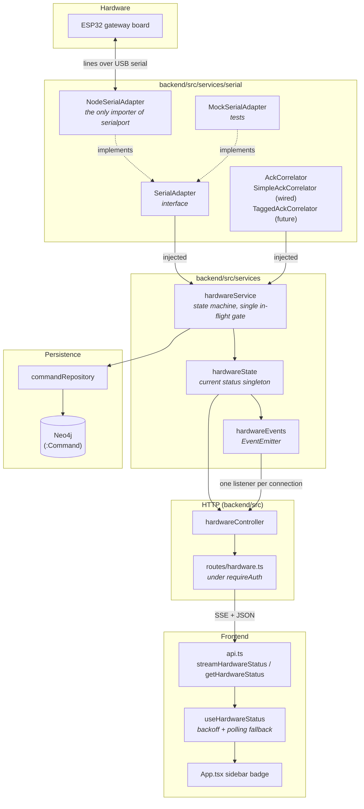
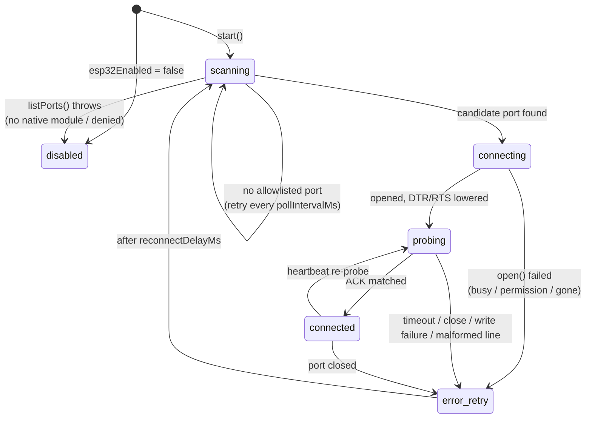
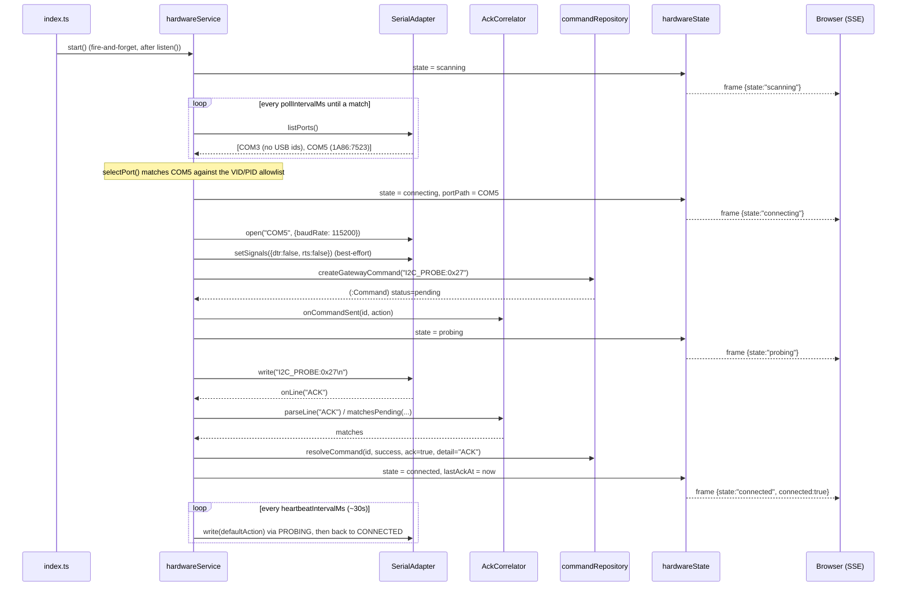
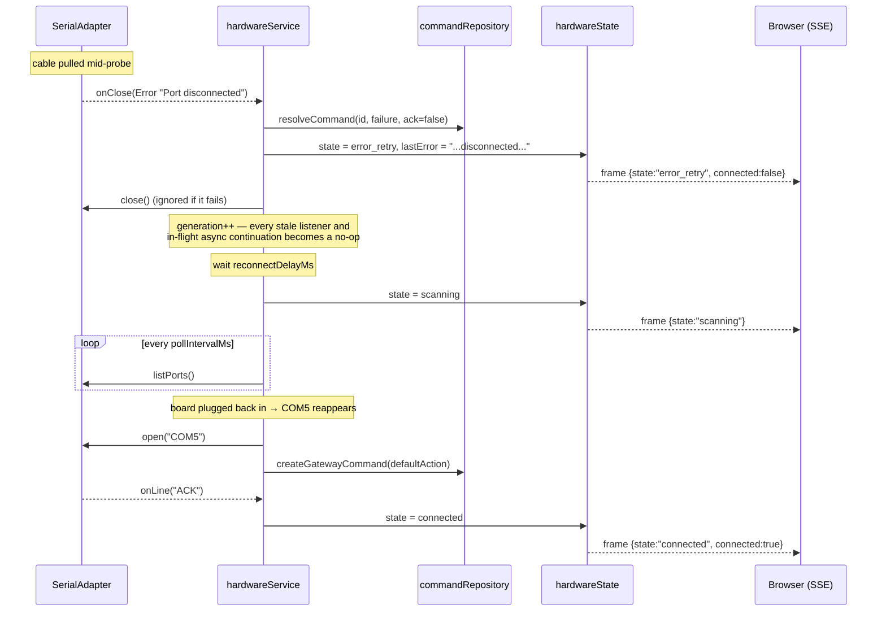

# Automatic Hardware ACK

CircuitLoop talks to an ESP32 "gateway" board over a USB serial port. This
document describes the automatic detect → connect → probe → acknowledge loop
that replaced the old manual workflow, in which confirming the board was
alive meant hand-running a `pyserial` one-liner in a terminal and reading the
output yourself.

The loop now runs continuously inside the backend, records every exchange in
Neo4j, and pushes each state change to the browser over Server-Sent Events,
so the sidebar badge reflects the real link without anyone asking it to.

**The peripheral is optional.** No board, no `serialport` build, a port owned
by another program, or the whole feature switched off all resolve to a
documented degraded state. None of them delay startup, fail a request to an
unrelated route, or crash the process.

---

## Architecture



### Why the two seams exist

**`SerialAdapter`** keeps the state machine free of `serialport`. That buys
two things. The whole machine is testable with no hardware and no native
module, via `MockSerialAdapter`. And because `NodeSerialAdapter` loads
`serialport` with a *dynamic* import, a missing or unbuildable native addon
becomes a rejected `listPorts()` promise — handled as the terminal `disabled`
state — instead of an exception thrown while the module graph is still being
evaluated, which would take the entire API down before Express existed.

**`AckCorrelator`** keeps the *matching rule* out of the control flow. The
firmware today replies with one unstructured line carrying no command id, so
the only correlation available is positional: the next line back belongs to
the command just sent. `SimpleAckCorrelator` does exactly that, and it is
correct only because the state machine allows one command in flight at a
time. That is a property of today's protocol, not of the design.
`TaggedAckCorrelator` implements the tagged alternative
(`CMD:<id>:<ACTION>` out, `ACK:<id>` back) and is fully unit-tested but
deliberately **not wired in**, because the firmware does not speak it yet.
Switching is one line in `hardwareService`; nothing else changes.

---

## State machine



`state` is authoritative. The `connected` boolean in the API is derived from
it (`state === "connected"`) in one place and is never set independently.

`disabled` is the only terminal state. It is reached either deliberately
(`CIRCUITLOOP_ESP32_ENABLED=false`) or because port *enumeration itself*
failed — which says the serial layer is unusable on this machine rather than
that no board is plugged in, so retrying it every few seconds forever would
only produce noise.

### Single in-flight command

`PROBING` **is** the concurrency gate. There is no separate queue or mutex.
A `sendAction()` arriving while a command is outstanding fails immediately
with `409 ConflictError` rather than interleaving a second write onto the same
wire. The automatic heartbeat obeys the same rule: if a user's command is in
flight it yields and tries again at the next interval.

This is also what makes positional ACK matching sound — with exactly one
outstanding command there is only one candidate a reply could belong to.

---

## Sequence: auto-detect → connect → probe → ACK



The `(:Command)` node is created and the pending slot armed **before** the
bytes go out, so a board that answers instantly cannot beat its own handler
into place.

`setSignals({dtr:false, rts:false})` is best-effort and its failure is
non-fatal. On many ESP32 dev boards DTR and RTS are wired to EN/BOOT through
an auto-reset circuit, so leaving them asserted reboots the board the instant
the port opens and the probe then races the bootloader. Platforms that cannot
set the lines simply mean the board may reset once.

## Sequence: unplug → reconnect



A **generation counter** is what makes reconnection safe. Every teardown
bumps it, and each async continuation (an awaited `listPorts`, an in-progress
`open`, a line handler from the previous connection) checks the value it
started under before touching shared state. A slow adapter call that resolves
after a teardown therefore cannot resurrect a dead connection or schedule a
timer on a service meant to be idle.

An ACK arriving in the same tick as its own timeout is a real race, and both
paths lead to resolution. The pending slot is claimed synchronously by
whichever runs first, and `resolveCommand`'s Cypher additionally guards on
`status = 'pending'`, so a late ACK can never rewrite a command already
recorded as a timeout.

---

## API

All routes are mounted at `/api/hardware` and sit behind `requireAuth`; every
one answers `401` without a valid session cookie.

| Method | Path | Body | Success | Errors |
| --- | --- | --- | --- | --- |
| `GET` | `/api/hardware/status` | — | `200` `HardwareStatus` | `401` |
| `GET` | `/api/hardware/stream` | — | `200` `text/event-stream`; immediate snapshot, then one frame per state change | `401` |
| `POST` | `/api/hardware/action` | `{ action, component_id? }` | `200` the **resolved** `Command` | `400`, `401`, `404`, `409`, `502`, `503` |

### `HardwareStatus`

The same object is returned by `/status` and carried in every `/stream`
frame, so the polling fallback and the live stream deliver identical data.

```json
{
  "state": "connected",
  "connected": true,
  "port_path": "COM5",
  "last_ack_at": "2026-01-01T12:00:00.000Z",
  "last_error": null,
  "last_command": {
    "id": "0f3c…",
    "action": "I2C_PROBE:0x27",
    "status": "success",
    "sent_at": "2026-01-01T12:00:00.000Z",
    "resolved_at": "2026-01-01T12:00:00.014Z",
    "ack_received": true,
    "detail": "ACK",
    "component_id": null
  }
}
```

`GET /status` is **always `200`**. "No board connected" is a fully
describable state (`"scanning"`), not a missing resource, so a client never
has to special-case an error body.

`state` is what you render from. Do not drive a UI off `connected` toggling:
a healthy board re-enters `probing` on every heartbeat, so a badge watching
that boolean would blink between connected and disconnected every 30 seconds
on a link that is perfectly fine.

### `POST /api/hardware/action`

```jsonc
{ "action": "COMPONENT_TEST", "component_id": "8b21…" }  // component_id optional
```

`action` is validated for **shape, not vocabulary**: non-empty, at most 128
characters, and free of newlines and other control characters. There is
deliberately no enum, so `COMPONENT_TEST`, `CAPTURE_READING`, `LCD_SCAN`,
`PINOUT_CHECK`, `RELAY_TOGGLE:3` and anything the firmware gains tomorrow all
work today with no backend change — a new named convenience action is a
frontend-only addition. Newlines are rejected because the service appends the
line terminator itself, so an embedded one would smuggle a second,
uncorrelated command onto the wire.

`component_id` omitted or `null` means a gateway-level command belonging to no
component. When set it must be a component the caller owns, enforced by
ownership-scoped Cypher.

The request resolves only once the board has actually acknowledged, so the
returned command is the resolved record rather than an optimistic receipt.

| Status | Meaning |
| --- | --- |
| `400` | Empty, over-long, or control-character-bearing `action`. |
| `404` | `component_id` is unknown *or* belongs to another user — deliberately indistinguishable. |
| `409` | A command is already in flight (the single in-flight gate). |
| `502` | The board replied with a malformed line — almost always a baud mismatch. |
| `503` | Hardware is `disabled`, no gateway is connected yet, or the ACK timed out. |

### `GET /api/hardware/stream`

Standard SSE: `data: {json}\n\n` frames. The first frame is an immediate
snapshot so a client connecting during a long-stable period renders the real
state at once rather than waiting up to a heartbeat for the next transition.

One `hardwareEvents` listener is registered per connection and removed in
`req.on("close")`. This is load-bearing: `hardwareEvents` is a long-lived
module singleton, so without that cleanup every browser tab that ever opened
the dashboard would leave a listener behind writing into a dead socket
forever. `tests/hardwareRoutes.test.ts` asserts the listener count returns to
its baseline after a client disconnects.

The frontend consumes this with `fetch` and a stream reader rather than the
browser's `EventSource`, because `EventSource` cannot be given
`credentials: "include"` (so it would not carry the httpOnly session cookie
to an API on another origin) and its built-in reconnection would fight the
deliberate backoff policy in `useHardwareStatus`.

---

## Configuration

Every variable is optional. With none of them set, the loop auto-detects a
board at 115200 baud and probes it — which is the intended default.

| Variable | Default | Meaning |
| --- | --- | --- |
| `CIRCUITLOOP_ESP32_ENABLED` | `true` | Master switch. `false` parks the machine in `disabled` without ever touching a serial port. Must be exactly `true` or `false`; anything else is a startup error rather than a silent disable. |
| `CIRCUITLOOP_ESP32_PORT` | *(unset)* | Explicit port (`COM5`, `/dev/ttyUSB0`). When set, the VID/PID allowlist is not consulted at all. |
| `CIRCUITLOOP_ESP32_BAUD` | `115200` | Serial baud rate. Must match the firmware. |
| `CIRCUITLOOP_ESP32_ACK_TIMEOUT_MS` | `5000` | How long to wait for the ACK line before giving up on a command. |
| `CIRCUITLOOP_ESP32_POLL_INTERVAL_MS` | `3000` | How often to re-scan serial ports while looking for a board. |
| `CIRCUITLOOP_ESP32_RECONNECT_DELAY_MS` | `5000` | Wait after a disconnect, timeout, or failed open before scanning again. |
| `CIRCUITLOOP_ESP32_DEFAULT_ACTION` | `I2C_PROBE:0x27` | Action written on connect and on every heartbeat. The automatic probe's default only — not a limit on what `POST /action` accepts. |
| `CIRCUITLOOP_ESP32_VID_PID_ALLOWLIST` | see below | Comma-separated USB `VID:PID` pairs treated as a gateway during auto-detection. Case-insensitive; an `0x` prefix is tolerated. |

Default allowlist — the USB-serial bridges ESP32 dev boards ship with:

```
1A86:7523  CH340/CH341        0403:6001  FTDI FT232R
1A86:5523  CH341 serial mode  0403:6010  FTDI FT2232
10C4:EA60  CP2102/CP2109      0403:6014  FTDI FT232H
303A:1001  Espressif USB CDC  0403:6015  FTDI FT231X
```

**The heartbeat interval is not a separate variable.** It is
`CIRCUITLOOP_ESP32_POLL_INTERVAL_MS × 10` — 30 seconds at the default. Every
heartbeat writes a durable `(:Command)` node, so the cadence is really a
decision about how fast the graph grows: at the 3-second poll interval it
would be roughly 29,000 nodes a day for an idle, healthy board. Ten-to-one
keeps liveness detection well inside a user's attention span while keeping
that bounded.

Ports reporting **no USB ids at all** (built-in serial hardware such as Intel
AMT serial-over-LAN, or Bluetooth bridges) never match the allowlist. Opening
one at random would be an unpleasant surprise, so no ids means no match — name
the port explicitly if you really do want one of them.

---

## Setup

### 1. Install the serial dependency

`serialport` is already listed in `backend/package.json`:

```bash
cd backend && npm install
```

It is a native addon and normally installs a prebuilt binary. If no prebuilt
exists for your Node/OS/arch it will try to compile, which needs a toolchain
(Visual Studio Build Tools on Windows, `build-essential` + `python3`
elsewhere). **If this fails, the rest of CircuitLoop still works** — the
backend starts, every other route serves normally, and hardware status reads
`disabled` with the load error in `last_error`.

### 2. Plug the board in and start the app

```bash
npm run dev     # from the repo root
```

Watch the structured log lines, or the sidebar badge:

```
[…] [INFO] {"event":"port_detected","entityType":"hardware_connection","entityId":"COM5",…}
[…] [INFO] {"event":"port_opened",…}
[…] [INFO] {"event":"probe_sent","entityType":"hardware_command","entityId":"…",…}
[…] [INFO] {"event":"ack_received",…,"state":"connected"}
```

### 3. If your board is not detected

Find its USB ids and add the pair to the allowlist.

- **Windows** — Device Manager → Ports (COM & LPT) → your device →
  Properties → Details → Hardware Ids. You want the `VID_xxxx&PID_xxxx`.
- **Linux / macOS** — `lsusb` (Linux) or
  `system_profiler SPUSBDataType` (macOS).

```bash
# backend/.env
CIRCUITLOOP_ESP32_VID_PID_ALLOWLIST=1A86:7523,10C4:EA60,1234:5678
```

Or skip detection entirely and name the port:

```bash
CIRCUITLOOP_ESP32_PORT=COM5
```

### Logging

Every event is one line whose message is a JSON payload with a stable shape:

```ts
{ event, entityType: "hardware_command" | "hardware_connection", entityId?, state?, error?, timestamp }
```

Events: `port_detected`, `port_opened`, `set_signals_unsupported`,
`probe_sent`, `command_sent`, `ack_received`, `ack_timeout`,
`malformed_response`, `disconnect`, `port_open_failed`, `reconnect_attempt`,
`reconnect_success`, `adapter_unavailable`.

---

## Troubleshooting

Start by reading `last_error` — `GET /api/hardware/status` always returns it,
and the sidebar badge shows it in its tooltip. It carries the specific reason
for the current state, which is usually the whole answer.

```bash
curl --cookie "circuitloop_session=…" http://127.0.0.1:8000/api/hardware/status
```

### The badge says "Hardware off"

`CIRCUITLOOP_ESP32_ENABLED=false`, or the serial layer could not be loaded.
`last_error` distinguishes them:

- `"Hardware support is disabled (CIRCUITLOOP_ESP32_ENABLED=false)."` —
  deliberate. Remove the variable or set it to `true`.
- `"Serial port enumeration is unavailable: …"` — `serialport` failed to
  load. Re-run `npm install` in `backend/` and read the build output. This
  state is terminal by design and needs a restart after fixing the install.

### The badge stays on "Searching for gateway"

Ports are being enumerated fine but none match.

1. Is the board actually enumerating? Check Device Manager / `lsusb`. A
   charge-only USB cable is the classic cause — it powers the board, so it
   *looks* connected, but carries no data lines and no port ever appears.
2. If it enumerates, its VID:PID is not in the allowlist. Add it (see Setup
   step 3) or set `CIRCUITLOOP_ESP32_PORT`.
3. If you set `CIRCUITLOOP_ESP32_PORT`, check the spelling. A named port that
   is absent leaves the machine scanning rather than failing loudly —
   deliberately, so a typo stays recoverable.

### Port busy — `last_error` contains "Could not open … Access denied"

Something else holds the port. On Windows the usual suspects are the Arduino
IDE serial monitor, PlatformIO, PuTTY, or a second CircuitLoop backend still
running. Close it; the loop retries every `reconnectDelayMs` and reconnects on
its own without a restart.

### Windows COM permission denied

Less common than "busy", but real:

- Some USB-serial drivers require the app's elevation level to match the one
  that installed them. Try running the backend from an ordinary
  (non-elevated) shell, or reinstall the CH340/CP210x driver.
- Corporate endpoint-protection software sometimes blocks removable serial
  devices outright. Nothing application-side fixes this; it needs a policy
  exception.

On Linux the equivalent is group membership: add yourself to `dialout`
(`sudo usermod -aG dialout $USER`) and log out and back in.

### Wrong baud rate — `502`, or `last_error` mentioning "Malformed response"

A baud mismatch does not produce silence, it produces garbage: the UART
frames noise and the reader hands back a long run of junk. The service refuses
to treat that as an ACK, because reporting a healthy link that cannot actually
be talked to is worse than reporting a fault.

Set `CIRCUITLOOP_ESP32_BAUD` to whatever the firmware's `Serial.begin(...)`
uses. `115200` is the CircuitLoop firmware's rate and the default here.

### Silent no-response — `last_error` "No ACK for … within 5000ms"

The port opened but nothing came back.

1. **Wrong action.** The firmware may not implement
   `CIRCUITLOOP_ESP32_DEFAULT_ACTION`. Set it to a command your build
   actually handles.
2. **Line terminator mismatch.** The backend writes `\n` and reads
   `\n`-delimited lines with a trailing `\r` stripped. Firmware using
   `Serial.print` without a newline never completes a line, so nothing is
   ever delivered.
3. **The board reset when the port opened.** DTR/RTS are lowered on open
   precisely to avoid this, but if `set_signals_unsupported` appears in the
   log the platform refused, and the board may be in its bootloader while the
   probe runs. A longer `CIRCUITLOOP_ESP32_ACK_TIMEOUT_MS` usually covers it.
4. **Genuinely dead firmware.** Confirm independently with a serial monitor
   at the same baud — but close it again afterwards, or you will trade this
   problem for "port busy".

### `409 Conflict` on `POST /api/hardware/action`

Working as intended: one command may be in flight at a time. Wait for the
current one to resolve — at most `CIRCUITLOOP_ESP32_ACK_TIMEOUT_MS` — and
retry. Note the ~30-second heartbeat also briefly takes the slot, so a client
that fires actions continuously should expect an occasional `409` and simply
retry rather than treating it as an error.

### The badge says "Status unavailable"

That is the *frontend* reporting `mode: "lost"` — the backend itself is
unreachable, so the last hardware status it holds is stale and is deliberately
not presented as current. Check the backend is running. The hook keeps
retrying SSE with exponential backoff in the background and recovers on its
own; nothing needs reloading.

---

## Testing

No hardware is required for any of it.

```bash
cd backend  && npm run typecheck && npm test
cd frontend && npm test
```

- `tests/hardwareService.test.ts` — the state machine over
  `MockSerialAdapter` with the repository mocked, so it needs neither a board
  nor a database: ACK success, silent-board timeout, busy port, permission
  denial, unplug mid-probe, failed write, garbage line, automatic reconnect,
  VID/PID filtering and port override, disabled mode, the single-in-flight
  `409`, ownership `404`, `start()` idempotence, `stop()` teardown, the
  heartbeat, and the invariant that `connected === (state === "connected")`
  on every emitted frame.
- `tests/ackCorrelator.test.ts` — both correlators. The `TaggedAckCorrelator`
  cases are what keep "the abstraction really does support a tagged protocol"
  from being merely an assertion in a comment.
- `tests/commandRepository.test.ts` — real Cypher against a live Neo4j using
  the transaction-rollback pattern; skips itself when no database is
  reachable.
- `tests/hardwareRoutes.test.ts` — `401`s on all three routes with no
  database needed, plus integration coverage of the status shape, the
  `503`/`409`/`400`/`404` paths, and SSE listener cleanup on disconnect.
- `frontend/src/hooks/useHardwareStatus.test.ts` — the backoff sequence and
  the full SSE-failure → polling-fallback → SSE-recovery → resumed-streaming
  cycle.
